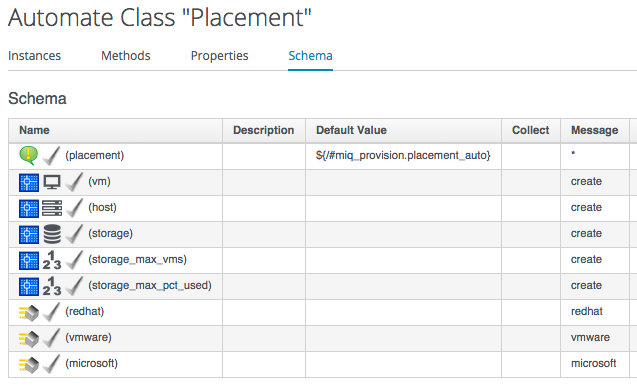
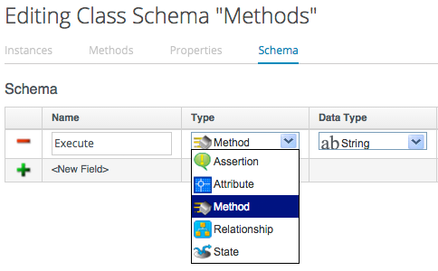
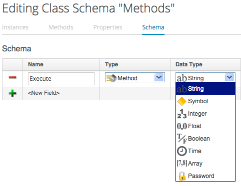

## Classes, Schemas and Instances

### Classes
A **Class** is similar to a template, it contains a generic definition for a set of automation operations. Each Class has a **Schema**, that defines the variables, states, relationships or methods that **Instances** of the class will use. 

### Schemas
A **Schema** is made up of a number of elements, or _fields_. A schema often has just one entry - to run a single **Method** - but in many cases it has several components, for example...
   

 
Each field is added or edited in the schema editor by specifying the field _Type_ from a drop-down list...
   

 
...and the field _Data Type_ from a drop-down list...
   

 
We can define default values for fields in a class schema, which will be inherited by all instances created from the class, but can be optionally over-ridden in the schemas of any particular instance.

### Instances

An **Instance** is a specific "clone" of the generic class, and is the entity run in the context of _$evm.root_ by the Automation Engine. An Instance contains a copy of the Class schema but with actual values of the fields filled in.

### Relationships

One of the schema field types is **Relationship**, and these are links to other Instances elsewhere in the Automation Datastore. We often use relationships as a way of chaining Instances together, and relationship values can accept variable substitutions for flexibility as shown...
   

