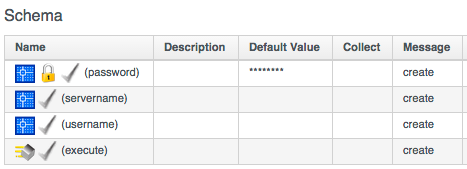

## More Advanced Class and Schema Concepts
There are three more Class/Schema concepts that we use with varying degrees of frequency.

### Messages
Each Schema Field has a **Message** column/value that we can optionally use to identify a particular Field to execute or evaluate when we call the Instance. We can think of this as an index key into the schema.

The default message is _create_, and if we look at the schema that we created for our `/ACME/General/Methods` class, we see that the default Message value of _create_ was automatically set for us for all fields:
<br> <br>



<br>
We specify the Message when we create a Relationship to an Instance, by appending `#message` after the URI to the Instance. If we don't explicitly specify a Message then `#create` is implicitly used.

For example we could create a Relationship to run our first _HelloWorld_ Instance, using a URI of either:

```
/ACME/General/Methods/HelloWorld
```

or

```
/ACME/General/Methods/HelloWorld#create
```

In both cases the `hello_world` Method would execute as this is the _Method_ schema field "indexed" by the _create_ message.

#### Specifying our own Messages
It can be useful to create a Class/Instance schema that allows for one of several Methods to be executed, depending on the Message passed to the Instance at run-time. For example the Schema for the `Infrastructure/VM/Provisioning/Placement` Class allows for a Provider-specific VM placement algorithm to be created:
<br> <br>


<br>
The `default` Instance created from this Class has the Method values filled in accordingly:
<br> <br>


<br>
This means that it can be called as part of the VM Provisioning State Machine, by appending a Message created from a variable substitution corresponding to the provisioning source vendor (i.e. redhat, vmware or microsoft):

```
/Infrastructure/VM/Provisioning/Placement/default#${/#miq_provision.source.vendor}
```

<br> <br>
In this way we are able to create a generic Class and Instance definition that contains several Methods, and the choice of which Method to run can be selected dynamically at run-time by using a Message.

### Assertions
An _Assertion_ is a boolean check that we can put in our Class schema. Assertions are always processed first, regardless of their position on the schema. If an Assertion evaluates to _true_ the remaining Instance schema fields are processed, (i.e. the Instance continues to run). If an Assertion evaluates to _false_ the remainder of the Instance fields are not processed, and the Instance stops.

An example of an Assertion is found at the start of the Schema for the `Placement` Class. Placement methods are only relevant if the **Automatic** check box has been selected at provisioning time, and this check box sets a boolean value `miq_provision.placement_auto`. The Assertion checks that this value is true, and prevents the remainder of the Instance from running if automatic placement has not been selected.


<br><br>

### Collect
As we have seen, there is a parent - child relationship between the `$evm.root` object (the one whose instantiation took us into the Automation Engine), and subsequent objects created as a result of following schema relationships or by calling `$evm.instantiate`.

If a child object has Achema Attribute values, it can read or write to them by using its own `$evm.object` hash (e.g. we saw the use of `$evm.object['username']` in [Using Schema Object Variables](../chapter3/using_schema_object_variables.md)). Sometimes we need to propagate these values back up the parent `$evm.root` object, and we do this using _Collections_.

We define a value to collect in the **Collect** Schema column, using the syntax ```/root_variable_name = schema_variable_name```, e.g.
<br> <br>


<br>

In this example Schema, the child object has three Schema attributes defined, **pre\_dialog\_name**, **dialog_name**, and **state_machine**.

If a local Method were to reference these it would use the syntax `$evm.object['pre_dialog_name']`, `$evm.object['dialog_name']` or `$evm.object['state_machine']`, however the **Collect** value also makes these same Attribute values available to the root object as `$evm.root['dialog_name']` and `$evm.root['state_machine']`.

Collections make it possible for root objects to spawn "worker" child Instances to discover various Attribute values, and to have these values propagated back to the root object to be used in "bigger picture" coordination and orchestration tasks.


