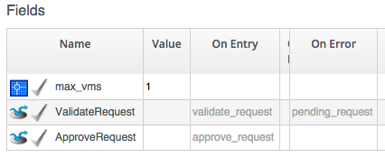

## Approval

The approval process for a VM Provision Request is entered as a result of the `/System/Policy/MiqProvisionRequest_created` policy being run from a _request\_created_ event. This results in a VM Provisioning Profile lookup to read the value of the **auto\_approval\_state\_machine** attribute, which by default is `ProvisionRequestApproval` for an Infrastructure VM Provision Request. The second relationship from the event runs the `Default` Instance of this State Machine.
   

 
The Schema for the `ProvisionRequestApproval` State Machine is:
   

 
The `Default` Instance has the following Field values:
   

 

This Instance will auto-approve any VM Provisioning Request containing a single VM, but requests for more than this number will require explicit approval from an Administrator, or anyone in a Group with the role **EvmRole-approver** (or equivalent).

We can copy the `Default` Instance (including path) to our own Domain and change or set any of the auto-approval schema Attributes, i.e. **max_cpus**, **max_vms**, **max_memory** or **max\_retirement\_days**.

### Overriding the Schema Default - Template Tagging

We can override the auto-approval **max_*** values stored in the `ProvisionRequestApproval` State Machine on a per-Template basis, by applying tags from one or more of the following tag categories to the Template:
 

|  Tag Category Name  | Tag Category Display Name  |
|:----------:|:----------------:|
| prov\_max\_cpu | Auto Approve - Max CPU |
| prov\_max\_memory | Auto Approve - Max Memory |
| prov\_max\_retirement\_days | Auto Approve - Max Retirement Days |
| prov\_max\_vm | Auto Approve - Max VM |
 

If a Template is tagged in such a way, then any VM Provisioning Request _from_ that Template will result in the Template's tag value being used for auto-approval considerations, rather than the Attribute value from the schema.

### VM Provisioning-Related Email

There are four Email Instances with corresponding Methods that are used to handle the sending of VM Provisioning-related emails. The Instances each have the Attributes **to\_email\_address**, **from\_email\_address** and **signature** that can (and should) be customised, after copying the Instances to our own Domain.

Three of the Instances are approval-related. The **to\_email\_address** value for the `MiqProvisionRequest_Pending` Instance should contain the email address of a user (or mailing list) who is able to login to the CloudForms appliance as an Administrator or as a member of a Group with the role **EvmRole-approver** (or equivalent).
   

 

