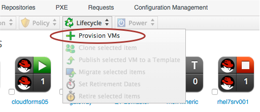
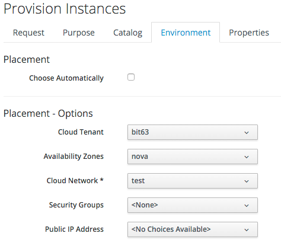

## Creating Provisoning Requests Programmatically

The most common way to provision a VM is via the CloudForms WebUI, i.e.
<br> <br>


<br>

We can also. however, initiate the provisioning process programmatically by calling `$evm.execute` to run the method `create_provision_request`. This method takes a number of arguments, which correspond to the argument list for the EVMProvisionRequestEx SOAP API call. A typical call to provision a VM into RHEV might be:
<br> <br>

```
# arg1 = version
args = ['1.1']

# arg2 = templateFields
args << {'name'         => 'rhel7-generic', 
		 'request_type' => 'template'}

# arg3 = vmFields
args << {'vm_name'   => 'rhel7srv010', 
		 'vlan'      => 'public', 
		 'vm_memory' => '1024'}

# arg4 = requester
args << {'owner_email'      => 'pemcg@bit63.com', 
		 'owner_first_name' => 'Peter',
		 'owner_last_name'  => 'McGowan'}

# arg5 = tags
args << nil

# arg6 = additionalValues (ws_values)
args << {'disk_size_gb' => '50',
			'mountpoint' => '/opt'}

# arg7 = emsCustomAttributes
args << nil

# arg8 = miqCustomAttributes
args << nil

request_id = $evm.execute('create_provision_request', *args)
```
### Argument List
The arguments to the `create_provision_request` call are described below. The arguments match the fields in the Provisioning Dialog (and the values from the corresponding YAML template), and any arguments that are set to **required: true** in the Dialog YAML, but don't have a **:default:** value, should be specified. The exception for this is for sub-dependencies of other options, for example if **:provision\_type:** is _pxe_ then the sub-option **:pxe\_image\_id:** is mandatory. If the **:provision\_type:** value is anything else then **:pxe\_image\_id:** is not relevant.

In ManageIQ versions prior to _Capablanca_ the arguments were specified as a string, with each value separated by a pipe ('|') symbol, i.e.

```
"vm_name=rhel7srv010|vlan=public|vm_memory=1024"
```

With _Capablanca_ (CloudForms Management Engine 5.5) however this syntax has been deprecated, and the options within each argument type should be defined as a hash as shown in the example above. This is more compatible with the equivalent RESTful API call to create a provisioning request.

The _value_ for each hashed argument pair should always be a string, for example `{'number_of_vms' => '4'}` rather than `{'number_of_vms' => 4}`.

#### version

Interface version. Should be set to 1.1

#### templateFields

Fields used to specify the VM or Template to use as the source for the provisioning operation. Supply a _guid_ or _ems\_guid_ to protect against matching same-named templates on different Providers within CloudForms Management Engine. The **request\_type** field should be set to one of: **template**, **clone\_to\_template**, or **clone\_to\_vm** as appropriate. A normal VM provision from template is specified as:

```
'request_type' => 'template'
```

#### vmFields

Allows for the setting of properties from the **Catalog**, **Hardware**, **Network**, **Customize**, and **Schedule** tabs in the Provisioning Dialog. Some of these are Provider-specific, so when provisoning an OpenStack Instance for example, we need to specify the **instance\_type**

```
# arg2 = vmFields
arg2 = {'number_of_vms'    => '3',
		 'instance_type'   => '1000000000007', # m1.small
		 'vm_name' 		 => "#{$instance_name}",
		 'retirement_warn' => "#{2.weeks}"}
args << arg2
```

#### requester

Allows for the setting of properties from the **Request** tab in the Provisioning Dialog. **owner_email**, **owner\_first\_name** and **owner\_last\_name** fields are required fields.

#### tags

Tags to apply to newly created VM, e.g.

```
{'server_role' => 'web_server',
 'cost_centre' => '0011'}
```

#### additionalValues (aka ws_values)

Additional values, also known as ws\_values, are name-value pairs stored with a provision request, but not used by the core provisioning code. These values are usually referenced from automate methods for custom processing. They are added into the Request Options Hash, and can be retrieved as a hash from:

```
$evm.root['miq_provision'].options[:ws_values]
```

#### emsCustomAttributes

Custom Attributes applied to the virtual machine through the Provider as part of provisioning. Not all Providers support this, although VMware does support native vCenter Custom Attributes, which if set are visible both in CloudForms and in the vSphere/vCenter UI.

#### miqCustomAttributes

Custom Attributes applied to the virtual machine and stored in the CloudForms Management Engine database as part of provisioning. These VMDB-specific Custom Attributes are displayed on the VM details page (see also [A More Advanced Example](../chapter5/a_more_advanced_example.md)).

### Setting Placement Options

The Rails code that implements the `create_provision_request` call makes the assumption that any non-interactive provision request will be using Automatic placement, and it sets `options[:placement_auto] = [true, 1]` as a request option. This also means however that it disregards any **vmFields** options that we may set that are normally found under the **Environment** tab of an interactive provision request, such as `cloud_tenant` or `cloud_network` (these are hidden in the WebUI if we tick **Choose Automatically**).



If we try adding one of these (such as `cloud_network`), we see in evm.log:

```
Unprocessed key <cloud_network> with value <"1000000000007">
```
The only way that we can set any of these placement options is to add them to the **additionalValues/ws\_values (arg6)** argument list, and then handle them ourselves in the **CustomizeRequest** stage of the State Machine.

For example, in our call to `create_provision_request` we can set:

```
# arg6 = additionalValues (ws_values)
args << {'cloud_network' => '10000000000031'
		 'cloud_tenant   => '10000000000012'}
```

We can then copy `ManageIQ/Cloud/VM/Provisioning/StateMachines/Methods/openstack_CustomizeRequest` into our own domain, and edit as follows:

```ruby
#
# Description: This method is used to Customize the Openstack Provisioning Request
#
def find_object_for(rsc_class, id_or_name)
  if /\d{13}/.match(id_or_name.to_s)
    # Looks like an ID
    obj = $evm.vmdb(rsc_class, id_or_name.to_s)
  else
    obj = $evm.vmdb(rsc_class).find_by_name(id_or_name.to_s)
  end
  $evm.log(:warn, "Couldn\'t find an object of class #{rsc_class} \
  			with an ID or name matching \'#{id_or_name}\'") if obj.nil?
  obj
end

# Get provisioning object
prov = $evm.root["miq_provision"]
ws_values = prov.options.fetch(:ws_values, {})

if ws_values.has_key?(:cloud_network)
  cloud_network = find_object_for('CloudNetwork', ws_values[:cloud_network])
  prov.set_cloud_network(cloud_network)
end
if ws_values.has_key?(:cloud_tenant)
  cloud_tenant = find_object_for('CloudTenant', ws_values[:cloud_tenant])
  prov.set_cloud_tenant(cloud_tenant)
end

$evm.log("info", "Provisioning ID:<#{prov.id}> Provision Request \
         ID:<#{prov.miq_provision_request.id}> Provision Type: <#{prov.provision_type}>")
```

### Calling create\_provision\_request From a Service Item Definition

One of the most common uses for calling `$evm.execute('create_provision_request')` is from a Service Catalog Item definition.

When we create a new a Service Catalog Item, we select from a drop-down list of available Catalog Item Types. This lists the defined Provider Types, but also an additional type of **Generic**. If we define a Catalog Item using a Provider Type, we pre-configure the Provisioning Dialog options, just as we would if we were provisioning the request interactively. This also includes the **Number of VMs** (`:number_of_vms`) option, and this cannot be changed once the Service Catalog Item is ordered.

If we wish to be able to dynamically select the number of VMs when we order a service, we must use the **Generic** Catalog Item Type, and call our own Automate Method that creates the provision request on-the-fly using `$evm.execute('create_provision_request')`. This can include an updated `:number_of_vms` as an **arg3** value.
