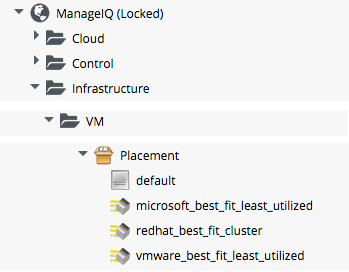
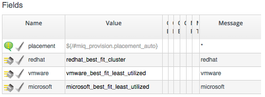
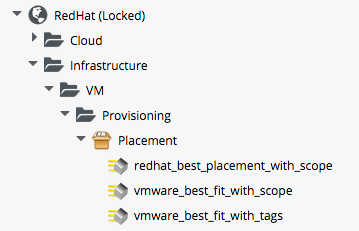
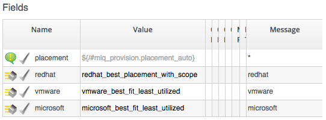

## VM Placement During Provisioning

One of the stages in the VMProvision\_VM State Machine is _Placement_, and it's here that the decision is made where to create the new VM, i.e. which Cluster, Host and Datastore.

The value for the _Placement_ stage in the _template_ Instance of this State Machine is:
<br>

```ruby
/Infrastructure/VM/Provisioning/Placement/default#${/#miq_provision.source.vendor}
```
<br>

<br>

The _default_ Instance is as follows:

<br>

<br>

...so we see the Provider-appropriate best-fit method being selected by the message. The _redhat\_best\_fit\_cluster_ Method just places the new VM into the same cluster as the source template. The other two Methods select the Host with the least running VMs, and most available Datastore space.

### Customising Placement

As part of the added-value that CloudForms brings over ManageIQ, the _RedHat_ Domain includes improved placement Methods that we can optionally use:

<br>

<br>

The _*\_with\_scope_ Methods allow us to apply a tag from the _prov\_scope_ (Provisioning Scope) tag category to selected Hosts and Datastores. This tag indicates whether or not they should be included for consideration for automatic VM placement. The _prov\_scope_ tag should be "all", or the name of an Access Control User Group. By tagging with a group name, we can direct selected workloads (such as developer VMs) to specific Hosts and Datastores.

The _vmware\_best\_fit\_with\_tags_ Method considers any Host or Datastore tagged with the same tag as the provisioning request, i.e. selected from the _Purpose_ tab of the Provisioning Dialog.

All three _RedHat_ Domain Methods also allow us to set thresholds for Datastore usage in terms of utilisation percentage, and number of exiting VMs, when considering Datastores for placement.

#### Using Alternative Placement Methods

To use the _RedHat_ Domain placement Methods (or any others that we choose to write), we copy the ```ManageIQ/Infrastructure/VM/Provisioning/Placement/default``` Instance into our own Domain, and edit the value for the _redhat_, _vmware_, or _microsoft_ schema fields as appropriate to specify the name of our preferred Method.

<br>

<br>
