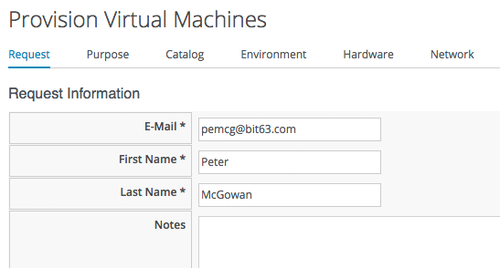

## Profile Processing (Deep Dive)

### The Provisioning Dialog

The first Profile query is performed as soon as the requesting user selects a Template to provision from, and clicks the _Continue_ button. The WebUI must launch the correct Provisioning Dialog for the target platform, operation type, and (optionally) the User Group, and it determines this information from the Profile (the Provisioning Dialog presents the main set of tabs and elements to prompt for all the information that we need to provision the VM, i.e. VM name, number of CPUs, VLAN, etc.)
<br> <br>




<br>
The Profile is queried using the messages _get\_pre\_dialog\_name_ and _get\_dialog\_name_ by an internal (non-Automate) method _miq\_request\_workflow.rb_ when we select a template and click the Continue button. It queries the _pre\_dialog\_name_ and _dialog\_name_ Attributes, and runs the _vm\_dialog\_name\_prefix_ Method:

```
...Querying Automate Profile for dialog name
...Invoking [inline] method [.../Profile/vm_dialog_name_prefix] with inputs [{}]
...vm_dialog_name_prefix> Detected Platform:<redhat>
...vm_dialog_name_prefix> Platform:<redhat> dialog_name_prefix:<miq_provision_redhat_dialogs>
...
...Loading dialogs <miq_provision_redhat_dialogs_template> for user <admin>
```

### VM Name (Pass 1)

The Profile is queried using the message _get\_vmname_ to retrieve the method to be used to formulate the name of the VM to be provisioned. This VM name is then inserted into the text string that will form the Request Object's _description_ attribute (_miq\_provision\_request.description_), e,g, "Provision from [rhel7-generic] to [rhel7srv004]".

If we are provisioning two or more VMs in a single request and letting Automate handle the VM auto number incrementing (e.g. rhel7srv005, rhel7srv006... etc) then the Request Object description is more generic, e.g. "Provision from [rhel7-generic] to [rhel7srvxxx]".

### Approval

Once the _Request_ object is created, we begin a series of Event-driven processing steps based on Instances in /System/Policy
<br> <br>


<br>
The first of these to be triggered is _MiqProvisionRequest\_created_. This contains two relationships, the first of which queries the Profile using the message _get\_auto\_approval\_state\_machine_ to retrieve the State Machine name to be used to handle the auto-approval process. The second relationship runs the _Default_ Instance of this State Machine.

#### Approved, Pending or Denied

Depending on the outcome of the approval process (approved, pending or denied), an email is sent to the requester by the corresponding Event/Policy Instance.

### Quota
The next Event-driven Policy Instance to be triggered is _MiqProvisionRequest\_starting_. This contains two relationships, the first of which queries the Profile using the message _get\_quota\_state\_machine_ to retrieve the State Machine name to be used to handle the quota-checking process. The second relationship runs the _Default_ Instance of this State Machine.

Once quota has been checked and passed, the _Request_ continues processing, and the _Task_ objects are created.

### VM Name (Pass 2)

The Profile is again queried using the message _get\_vmname_ to retrieve the method to be used to formulate the name of the VM to be provisioned. This second call is made while processing the Provisioning _Request_ as part of the creation of the _Tasks_ that will handle the provisioning of each VM in the _Request_. The derived VM name is added to the _Task_ object's options hash as ```miq_provision.options[:vm_target_name]``` and ```miq_provision.options[:vm_target_hostname]```. This is performed once per Task Object (there may be several Task Objects created for a single Request Object).

### VM Provisioning State Machine

Finally the Profile is used by the provisioning _Task_ to determine the State Machine to be used to provision the VM. A call is made to ```/infrastructure/VM/Lifecycle/Provisioning#create``` 

<br>


<br>
This Instance contains two relationships, the first of which queries the Profile using the message _get\_state\_machine_ to retrieve the State Machine name to be used to handle the provisioning of the VM. The second relationship runs the Instance of this State Machine whose name corresponds to a variable substitution for ```miq_provision.provision_type```. When performing a VM clone from template (the most common VM provision operation), this will be "template".
