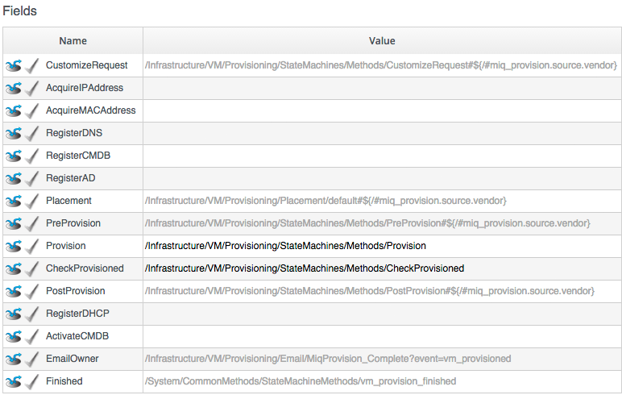

## The VM Provisioning State Machine

The VM Provisioning State Machine (VMProvision\_VM) schema contains a number of States, as shown (illustrated is the _template_ Instance of this State Machine):
<br>



<br>
Several of these States (such as _RegisterCMDB_, _RegisterAD_, etc.) contain no out-of-the-box values, but are there as placeholders should we wish to add the functionality to our own customised Instance.

Some States (such as _Placement_) have values ending in a variable substitution, such as:

```
	...StateMachines/Methods/PreProvision#${/#miq_provision.source.vendor}
```

This variable defines the message to be sent to the Instance handling that State, and allows us to dynamically select Provider-specific processing options (in this case allowing for alternative pre-provisioning options for VMware and RHEV):
<br> <br>


<br>
If we wish we can copy the State Machine into our own Domain, and add Instance URIs to any of the blank the States as required, or extend the State Machine by inserting new States. A common addition is to add a method at the _AcquireIPAddress_ step to retrieve an IP address from a corporate IPAM solution such as an Infoblox Appliance. Once retrieved, the IP address is inserted by the method into the _Task's_ options hash using the ```.set_option``` method, e.g.
<br> <br>

```ruby
$evm.root['miq_provision'].set_option(:ip_addr, allocated_ip_address)
```
