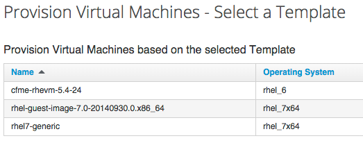

## Provisioning a VM

Possibly the most complex operation that is performed by the out-of-the-box Automation Engine is that of provisioning a VM. The process is, however, designed to be extremely flexible, and allows a great deal of customisation based on tagging, the requesting user's group membership, and the destination Provider type (e.g. RHEV, VMware, OpenStack, etc.). It uses all of the Automation features that we've discussed so far in the book.

### The Provisioning Process

The VM Provisioning Process starts with a user (the _requester_) selecting **Provision VMs** from under the **Infrastructure -> Virtual Machines -> Lifecycle** button group:
   

 

This takes us into a selection dialog where we pick a Template to provision from, and click the **Continue** button:
   

Once we click **Continue**, we enter into the VM Provisioning workflow, starting with information retrieved from the _Profile_ and moving into the _State Machine_.

### The Provisioning Profile and the VM Provisioning State Machine

Provisioning a VM involves many separate steps and decisions. Some of these need to be performed or evaluated in the context of the requesting user's group membership (such as quota evaluation, or custom VM naming), while others are more generic to all VM provisioning operations. The Provisioning/Group Profile contains the group-specific Attributes, Instance and State Machine names that are used in processing the provisioning _Request_, and in preparing the provisioning _Task(s)_.

The VM Provisioning State Machine is processed in the context of the provisioning _Task_, and contains the sequence of steps involved in actually provisioning the VM.
