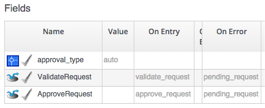

## Approval and Quota

### Approval

The approval process for a Service Provision Request is entered as a result of the _/ManageIQ/System/Policy/ServiceTemplateProvisionRequest\_created_ policy being run from a _request\_created_ event. This results in a Service Provisioning Profile lookup to read the value of the _auto\_approval\_state\_machine_ attribute, which by default is _ServiceProvisionRequestApproval_ for a Service Provision Request. The second relationship from the event runs the _Default_ Instance of this State Machine.
   

 
The Schema for the _ServiceProvisionRequestApproval_ State Machine is:
   

 
The _Default_ Instance has the following Field values:
   

 

This Instance will auto-approve all Service Provisioning Requests.

### Quota

Quota checking for Service Provision Requests is a new feature with CloudForms Management Engine 5.4, although by default it is turned off. The code to implement service quota checking is all held in the _RedHat_ Domain in the Automation Datastore.

The quota checking process for a Service Provision Request is entered as a result of the _/RedHat/System/Policy/ServiceTemplateProvisionRequest\_starting_ policy being run from a _request\_starting_ event. This results in a Provisioning Profile lookup to read the value of the _get\_quota\_state\_machine_ attribute, which by default is _ServiceProvisionRequestQuotaVerification_ for a Service Provision Request. The second relationship from the event runs the _Default_ Instance of this State Machine.

The Schema for the _ServiceProvisionRequestQuotaVerification_ State Machine is:
   

 
We can see two immediate differences between this and the VM Provisioning quota checking mechanism. The first difference is that we can only set quota limits on groups rather than individual users, and the second is that we can now set soft and hard quotas (_warn\_group\*_ and _max\_group\*_ values).

The _Default_ Instance of the State Machine has the following schema field values:
   

 

We can see that the default _Manage Quotas_ Attribute value is _false_, and no _warn\_group\*_ or _max\_group\*_  Attributes have been defined.

To enable service provision quota enforcement we need to copy the _Default_ Instance (including path) to our own Domain and set the _Manage Quotas_ Attribute to be _true_ in the schema.

We need to also set any of the _warn\*_ or _max\*_ quota limit Attributes in the schema. These quota settings will then apply to all Groups provisioning VMs from a Service Catalog.

If the service provisioning request would result in any of the _warn\*_ quotas being exceeded, then the requesting user is emailed using the _/Service/Provisioning/Email/ServiceTemplateProvisionRequest\_Warning_ email class.

If the service provisioning request would result in any of the _max\*_ quotas being exceeded, then the request is rejected, and the requesting user is emailed using the _/Service/Provisioning/Email/ServiceTemplateProvisionRequest\_Denied_ email class.
