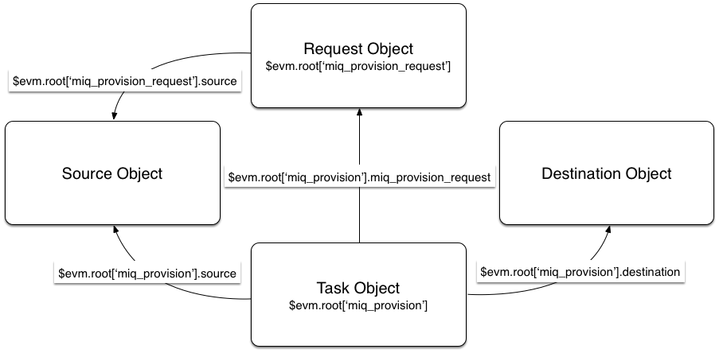

## VM Provisioning Objects

There are several objects involved in the VM provisioning process, however we generally only work with four of them when we program our own Automation Methods to interact with the VM Provisioning workflow.
<br> <br>



### The Request Object

We've discussed the **Request Object** in detail already - this is the object that contains all of the information relating to the VM Provisioning _Request_.

#### Request Context

When working at the _Request_ stage of the provisioning process, the object is accessible directly from our workspace...

```
$evm.root['miq_provision_request']
```

There are a number of useful attributes that we can read from the Request Object, including the requester (person) details, and we can set key/value pairs in the Options Hash to control the VM provisioning process itself.

The Request Object has a number of useful methods that we can use...

```ruby
miq_provision_request.add_tag
miq_provision_request.approve
miq_provision_request.authorized?
miq_provision_request.check_quota
miq_provision_request.ci_type
miq_provision_request.clear_tag
miq_provision_request.deny
miq_provision_request.description=
miq_provision_request.eligible_resources
miq_provision_request.get_classification
miq_provision_request.get_classifications
miq_provision_request.get_folder_paths
miq_provision_request.get_option
miq_provision_request.get_option_last
miq_provision_request.get_retirement_days
miq_provision_request.get_tag
miq_provision_request.get_tags
miq_provision_request.pending
miq_provision_request.register_automate_callback
miq_provision_request.set_cluster
miq_provision_request.set_customization_template
miq_provision_request.set_dvs
miq_provision_request.set_folder
miq_provision_request.set_host
miq_provision_request.set_iso_image
miq_provision_request.set_message
miq_provision_request.set_network_adapter
miq_provision_request.set_network_address_mode
miq_provision_request.set_nic_settings
miq_provision_request.set_option
miq_provision_request.set_pxe_image
miq_provision_request.set_pxe_server
miq_provision_request.set_resource
miq_provision_request.set_resource_pool
miq_provision_request.set_storage
miq_provision_request.set_vlan
miq_provision_request.set_vm_notes
miq_provision_request.set_windows_image
miq_provision_request.src_vm_id
miq_provision_request.target_type
```

#### Task Context

When working at the _Task_ stage we have a different workspace ($evm), and here $evm.root does not link directly to _miq\_provision\_request_. We can however still get to the Request Object via an association from the Task Object...

```
$evm.root['miq_provision'].miq_provision_request
```

Note that by the time we're in the _Task_, setting options in the _Request_ will have no effect, but it's still useful to be able to read values from the Request Object when in the _Task_ stage of the VM Provisioning process.

### The Task Object

The **Task Object** is created once the VM Provisioning _Request_ has been approved. Most of the information in the preceding Request Object is propagated into the Task Object, most importantly the Options Hash.

The Task Object has a similar set of Methods to the Request Object...

```
miq_provision.add_tag
miq_provision.check_quota
miq_provision.clear_tag
miq_provision.eligible_resources
miq_provision.execute
miq_provision.finished
miq_provision.get_classification
miq_provision.get_classifications
miq_provision.get_domain_details
miq_provision.get_domain_name
miq_provision.get_folder_paths
miq_provision.get_network_details
miq_provision.get_network_scope
miq_provision.get_option
miq_provision.get_option_last
miq_provision.get_tag
miq_provision.get_tags
miq_provision.message=
miq_provision.register_automate_callback
miq_provision.set_cluster
miq_provision.set_customization_spec
miq_provision.set_customization_template
miq_provision.set_dvs
miq_provision.set_folder
miq_provision.set_host
miq_provision.set_iso_image
miq_provision.set_network_adapter
miq_provision.set_network_address_mode
miq_provision.set_nic_settings
miq_provision.set_option
miq_provision.set_pxe_image
miq_provision.set_pxe_server
miq_provision.set_resource
miq_provision.set_resource_pool
miq_provision.set_storage
miq_provision.set_vlan
miq_provision.set_vm_notes
miq_provision.set_windows_image
miq_provision.statemachine_task_status
miq_provision.target_type
miq_provision.user_message=
```

...the most important of these probably being ```.execute``` which launches the VM provisioning job.

### The Source Object

When provisioning a VM from Template, we need an object to represent the source template itself, and this is the **Source Object**.

The Source Object is accessible via either of two associations...

```
$evm.root['miq_provision_request'].source
$evm.root['miq_provision_request'].vm_template
```

or

```
$evm.root['miq_provision'].source
$evm.root['miq_provision'].vm_template
```

...in either _Request_ or _Task_ context.

The Source Object contains a very useful Attribute...

```
source.vendor
```
...that has the value "RedHat", "VMware" or "Microsoft" if we're provisioning to an Infrastructure Provider. We can use this to determine the Provider type for this provisioning operation, and make workflow decisions accordingly. This Atttribute is used in several places in the out-of-the-box VMProvision\_VM State Machine to select the appropriate Instance to handle vendor-specific tasks such as VM Placement, i.e.

```
/Infrastructure/VM/Provisioning/Placement/default#${/#miq_provision.source.vendor}
```

There is also an equally useful Virtual Column...

```
source.platform
```

...that has the value "linux" or "windows", and we can similarly use this to make provisioning workflow decisions. We might typically use this to decide whether or not to register a new VM in Foreman/Satellite 6 as part of the provisioning process, for example.

All of the Source Object classes extend from MiqAeServiceVmOrTemplate, and so have the same methods as a generic VM. In practice we rarely need to run a source method.

### The Destination Object

Once the VM has been created (i.e. after the _Provision_ State of the VMProvision\_VM State Machine), we have an object that represents the newly created VM. This is the **Destination Object**.


The Destination Object is accessible as an association from the Task Object...

```
$evm.root['miq_provision'].destination
```

If we wish to make any customisations to the VM as part of the provisioning workflow, such as add a disk or NIC, change VLAN, etc., we make the changes to the Destination Object.

The Destination Object is a subclass of MiqAeServiceVmOrTemplate so has the standard set of VM-related methods...

```
destination.add_to_service
destination.changed_vm_value?
destination.collect_running_processes
destination.create_snapshot
destination.custom_get
destination.custom_keys
destination.custom_set
destination.ems_custom_get
destination.ems_custom_keys
destination.ems_custom_set
destination.ems_ref_string
destination.error_retiring?
destination.event_log_threshold?
destination.event_threshold?
destination.finish_retirement
destination.group=
destination.migrate
destination.owner=
destination.performances_maintains_value_for_duration?
destination.reboot_guest
destination.reconfigured_hardware_value?
destination.refresh
destination.registered?
destination.remove_all_snapshots
destination.remove_from_disk
destination.remove_from_service
destination.remove_from_vmdb
destination.remove_snapshot
destination.retire_now
destination.retired?
destination.retirement_state=
destination.retirement_warn=
destination.retires_on=
destination.retiring?
destination.revert_to_snapshot
destination.scan
destination.shutdown_guest
destination.snapshot_operation
destination.standby_guest
destination.start
destination.start_retirement
destination.stop
destination.suspend
destination.sync_or_async_ems_operation
destination.unlink_storage
destination.unregister
```

### Writing Generic Methods

If we write a generically useful Method such as one that adds a disk to a VM, it is useful to be able to call it in several ways. We might wish to add a disk during the provisioning workflow for the VM, from a button on an existing VM object in the WebUI, or even from an external RESTful call into the Automate Engine (passing the VM ID as an argument).

For each of these cases we need to access the target VM Object in a different way, but we can use the ```$evm.root['vmdb_object_type']``` key to help us establish context...


```ruby
case $evm.root['vmdb_object_type']
when 'miq_provision'                  # called from a VM provision workflow
  vm = $evm.root['miq_provision'].destination
  ...
when 'vm'
  vm = $evm.root['vm']                # called from a button
  ...
when 'automation_task'                # called from a RESTful automation request
  attrs = $evm.root['automation_task'].options[:attrs]
  vm_id = attrs[:vm_id]
  vm = $evm.vmdb('vm').find_by_id(vm_id)
  ...
end
```

