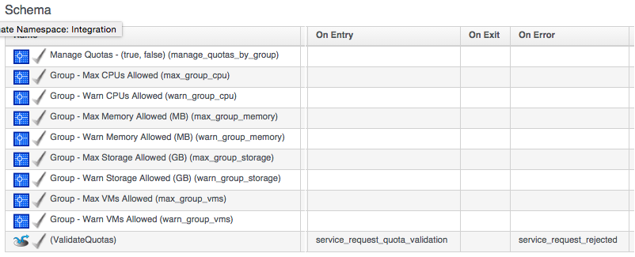
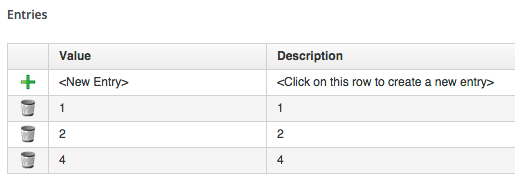

## Real-World Automation Example 3

### Scenario

We are using a RHEV Provider with our CloudForms installation, and we can successfully provision VMs using _Native Clone_ provision type from fully configured RHEV Templates. The Templates all have a single 30GB thin-provisioned hard drive.

### Task

We would like all VMs provisioned from these Templates to have a second 30GB hard drive added automatically during provisioning. The second drive should be created in the same RHEV Storage Domain as the first drive, (i.e. not hard-coded to a Storage Domain).

### Methodology

Edit the VMProvision_VM State Machine to add two new States to perform the task. We'll add the second disk using the RHEV RESTful API, using credentials stored for the Provider.

#### Step 1

The first thing we weed to do is clone the _/ManageIQ/Infrastructure/VM/Provisioning/StateMachines/VMProvision\_VM/Provision VM from Template (template)_ State Machine Instance into our own ACME Domain so that we can edit the schema...
<br> <br>


<br>
Now we edit the schema of the copied Class...
<br> <br>


<br>
...and add two more steps, _AddDisk_ and _StartVM_...
<br> <br>


Adjust the Class Schema Sequence so that the steps come after PostProvision...
<br> <br>


#### Step 2

We're going to override the default behaviour of the VM Provisioning workflow which is to auto-start a VM after provisioning. We do this because we want to add our new disk with the VM powered off, and then power on the VM ourselves afterwards.

We clone the _/ManageIQ/Infrastructure/VM/Provisioning/StateMachines/Methods/CustomizeRequest_ Instance, and _/ManageIQ/Infrastructure/VM/Provisioning/StateMachines/Methods/redhat\_CustomizeRequest_ Methods into our domain...
<br> <br>



<br>
We edit _redhat\_CustomizeRequest_ to set the Options Hash key ```:vm_auto_start``` to be ```false```...
<br> <br>

```ruby
#
# Description: This method is used to Customize the RHEV, RHEV PXE, 
# and RHEV ISO Provisioning Request
#

# Get provisioning object
prov = $evm.root["miq_provision"]

# Set the autostart parameter to false so that RHEV won't start the VM directly
prov.set_option(:vm_auto_start, [false, 0])                                                   

$evm.log("info", "Provisioning ID:<#{prov.id}> Provision Request \
ID:<#{prov.miq_provision_request.id}> Provision Type: <#{prov.provision_type}>")

```
#### Step 3
We need to add two new Instances _AddDisk_ and _StartVM_, and two new Methods _add\_disk_ and _start\_vm_. Add the corresponding Method names to the _execute_ schema field of each Instance...
<br> <br>


<br>
The code for add_disk is as follows...
<br> <br>


```ruby
#------------------------------------------------------------------------------
#
# CFME Automate Method: add_disk
#
# Authors: Kevin Morey, Peter McGowan (Red Hat)
#
# Notes: This method adds a disk to a RHEV VM
#
#------------------------------------------------------------------------------

require 'rest_client'
$LOAD_PATH.unshift "/opt/rh/ruby193/root/usr/share/gems/gems/xml-simple-1.0.12/lib"
require 'xmlsimple'

NEW_DISK_SIZE = 30
@debug = false

begin
  
  #------------------------------------------------------------------------------
  def call_rhev(servername, username, password, action, ref=nil, body_type=:xml, body=nil)
    #
    # If ref is a url then use that one instead
    #
    unless ref.nil?
      url = ref if ref.include?('http')
    end
    url ||= "https://#{servername}#{ref}"
    
    params = {
      :method => action,
      :url => url,
      :user => username,
      :password => password,
      :headers => { :content_type=>body_type, :accept=>:xml },
      :verify_ssl => false
    }
    params[:payload] = body if body
    if @debug
      $evm.log(:info, "Calling RHEVM at: #{url}")
      $evm.log(:info, "Action: #{action}")
      $evm.log(:info, "Payload: #{params[:payload]}")
    end
    response = RestClient::Request.new(params).execute
    #
    # RestClient raises an exception for us on any non-200 error
    # use XmlSimple to convert xml to ruby hash
    #
    response_hash = XmlSimple.xml_in(response)
    #
    $evm.log(:info, "Inspecting response_hash: #{response_hash.inspect}") if @debug
    #
    return response_hash
  end
  #------------------------------------------------------------------------------

  #------------------------------------------------------------------------------
  # Start of main code
  #
  vm = $evm.root['miq_provision'].destination
  storage_id = vm.storage_id rescue nil
  $evm.log(:info, "VM Storage ID: #{storage_id}") if @debug
  #
  # Extract the RHEV-specific Storage Domain ID
  #
  unless storage_id.nil? || storage_id.blank?
    storage = $evm.vmdb('storage').find_by_id(storage_id)
    storage_domain_id = storage.ems_ref.match(/.*\/(\w.*)$/)[1]
    if @debug
      $evm.log(:info, "Found Storage: #{storage.name}")
      $evm.log(:info, "ID: #{storage.id}")
      $evm.log(:info, "ems_ref: #{storage.ems_ref}") 
      $evm.log(:info, "storage_domain_id: #{storage_domain_id}")
    end
  end

  unless storage_domain_id.nil?
    #
    # Extract the IP address and credentials for the RHEV Provider
    #
    servername = vm.ext_management_system.ipaddress
    username = vm.ext_management_system.authentication_userid
    password = vm.ext_management_system.authentication_password

    disk_size_bytes = NEW_DISK_SIZE * 1024**3
    #
    # build xml body for the RHEV REST API call
    #
    body = "<disk>"
    body += "<storage_domains>"
    body += "<storage_domain id='#{storage_domain_id}'/>"
    body += "</storage_domains>"
    body += "<size>#{disk_size_bytes}</size>"
    body += "<type>system</type>"
    body += "<interface>virtio</interface>"
    body += "<format>cow</format>"
    body += "<bootable>false</bootable>"
    body += "</disk>"

    $evm.log(:info, "Adding #{NEW_DISK_SIZE}GB disk to VM: #{vm.name}")
    response = call_rhev(servername, username, password, :post, "#{vm.ems_ref}/disks", :xml, body)
    #
    # Pull out some re-usable href's from the initial response
    #
    activate_href = nil
    creation_status_href = nil
    disk_href = response['href']
    links = response['link']
    links.each do |link|
      if link['rel'] == "creation_status"
        creation_status_href = link['href']
      end
    end
    actions = response['actions'][0]['link']
    actions.each do |action|
      if action['rel'] == "activate"
        activate_href = action['href']
      end
    end
    #
    # Validate the creation_status (wait for up to a minute)
    #
    creation_status = response['creation_status'][0]['state'][0]
    counter = 13
    $evm.log(:info, "Creation Status: #{creation_status}")
    while creation_status != "complete"
      counter -= 1
      if counter == 0
        raise "Timeout waiting for new disk creation_status to reach \"complete\": \
               Creation Status = #{creation_status}"
      else
        sleep 5
        response = call_rhev(servername, username, password, :get, creation_status_href, :xml, nil)
        creation_status = response['status'][0]['state'][0]
        $evm.log(:info, "Creation Status: #{creation_status}")
      end
    end
    #
    # Disk has been created successfully, now check its activation status and if necessary activate it
    #
    response = call_rhev(servername, username, password, :get, disk_href, :xml, nil)
    if response['active'][0] != "true"
      $evm.log(:info, "Activating disk")
      body = "<action/>"
      response = call_rhev(servername, username, password, :post, activate_href, :xml, body)
    else
      $evm.log(:info, "New disk already active")
    end
  end
  #
  # Exit method
  #
  $evm.root['ae_result'] = 'ok'
  exit MIQ_OK
  #
  # Set Ruby rescue behavior
  #
rescue RestClient::Exception => err
  $evm.log(:error, "The REST request failed with code: #{err.response.code}") unless err.response.nil?
  $evm.log(:error, "The response body was:\n#{err.response.body.inspect}") unless err.response.nil?
  $evm.root['ae_reason'] = "The REST request failed with code: #{err.response.code}" unless err.response.nil?
  $evm.root['ae_result'] = 'error'
  exit MIQ_STOP
rescue => err
  $evm.log(:error, "[#{err}]\n#{err.backtrace.join("\n")}")
  $evm.root['ae_reason'] = "Unspecified error, see automation.log for backtrace"
  $evm.root['ae_result'] = 'error'
  exit MIQ_STOP
end
```
<br>
The code for start_vm is as follows...
<br> <br>

```ruby
#----------------------------------------------------------------
#
# CFME Automate Method: start_vm
#
# Author: Peter McGowan (Red Hat)
#
#----------------------------------------------------------------
begin
  vm = $evm.root['miq_provision'].destination
  $evm.log(:info, "Current VM power state = #{vm.power_state}")
  unless vm.power_state == 'on'
    vm.start
    vm.refresh
    $evm.root['ae_result'] = 'retry'
    $evm.root['ae_retry_interval'] = '30.seconds'
  else
    $evm.root['ae_result'] = 'ok'
  end
  
rescue => err
  $evm.log(:error, "[#{err}]\n#{err.backtrace.join("\n")}")
  $evm.root['ae_result'] = 'error'
end
```

#### Step 4

Now we edit our copied _Provision VM from Template_ State Machine Instance to add the AddDisk and StartVM Instance URIs to the appropriate steps...
<br> <br>


#### Step 5

Provision a VM. We should see the the VM is not immediately started after provisioning, and 
suitable messages in automation.log showing that our additonal Methods are working...
<br> <br>

```
...<AEMethod add_disk> Adding 30GB disk to VM: rhel7srv006
...<AEMethod add_disk> Creation Status: pending
...<AEMethod add_disk> Creation Status: complete
...<AEMethod add_disk> New disk already active
...
...<AEMethod start_vm> Current VM power state = off
...<AEMethod start_vm> Current VM power state = unknown
...<AEMethod start_vm> Current VM power state = on
```
<br>
If we look at the number of disks in the VM Details page in CloudForms, we see...
<br> <br>


<br>

Success!