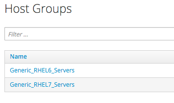
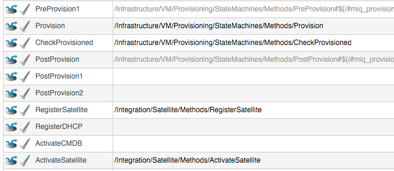
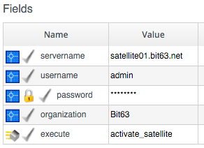
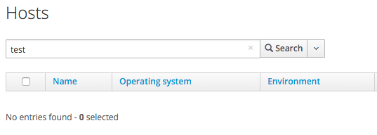
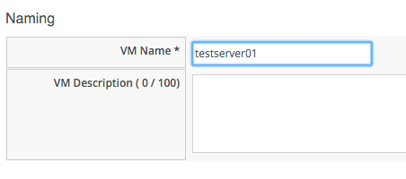
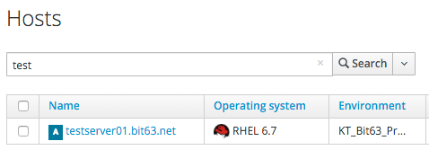

## Integrating with Satellite 6 During Provisioning

It is a relatively common requirement to register newly provisioned Linux VMs directly with Satellite 6 (or Foreman) as part of the provisioning process. This ensures that the resultant VM is patched and up to date, and is configured by Puppet according to a server role.

Registering a new system with Satellite 6.1 currently requires two operations. We need to create a Satellite _Host_ entry, which registers the server as a configuration management client, manageable by Puppet. We also need to use subscription-manager to activate the server as a _Content Host_, which associates one or more Red Hat Subscriptions with the server, and makes software package repository content available.

In this example we'll look at the changes that we need to make to our provisioning workflow to make this happen.

Christian Jung's excellent [blog](http://www.jung-christian.de) also contains several articles on CloudForms and Foreman integration, particularly when provisioning using kickstart. Some of the code here is borrowed from Chris's examples.

#### The Challenge of Triggering the Client Operations 

For this example we'll be provisioning into a VMware Provider, and cloning from fully installed 'fat' templates (i.e. no kickstarting). Cloning from Template (Infrastructure Providers) or Image (Cloud Providers) presents us with the challenge of how to initiate several commands on the new VM, including _subscription-manager register_, using dynamic arguments such as _--activationkey_ or _--org_.

There are several ways of remotely running commands in a newly created VM, including:

* VMware VIX SDK Library to connect to VMware Tools runing in a guest (VMware only)
* cloud-init (RHEV, OpenStack and Amazon Providers)
* ssh, including Ansible (all Providers)

<br>
For flexibility (at the expense of some added complexity), we'll be triggering the subscription-manager registration of the newly provisioned system using an Ansible playbook, dynamically created as part of the provisioning workflow.

### The Satellite 6 Host Entry

A Host entry in Satellite 6 requires certain parameters:

* Host Name
* Host's MAC address
* Location
* Organizaton
* Puppet Environment
* Architecture
* Operating System
* Media
* Partition Table
* Domain
* Root Password

We can however define a Host Group in Satellite, containing defaults for several of these parameters. When we create the Host entry, we can specify a Host Group as a configuration template.

### Non-CloudForms Preparation

We need to do some preparation of our environment. To keep the example simple we'll allow for provisioning Red Hat Enterprise Linux 6 and 7 servers (both x86_64), but we'll create a single Generic Host Group and Activation Key for each operating system version.

#### Creating the Host Groups in Satellite 6

We'll create two Host Groups in Satellite 6, _Generic\_RHEL6\_Servers_ and _Generic\_RHEL7\_Servers_:



These Host Groups will define defaults for:

* Puppet Environment
* Architecture
* Operating System
* Media
* Partition Table
* Domain
* Root Password

The Host Group will also install the _motd_ and _ntp_ Puppet modules.

#### Creating the Activation Keys in Satellite 6

When a newly provisioned system registers with Satellite as a _Content Host_, it can include an Activation Key name as an argument to subscription-manager.

We'll create two Activation Keys in Satellite 6, _RHEL6-Generic_ and _RHEL7-Generic_:


These Activation Keys will define defaults for:

* Content View and Lifecycle Environment ('Production')
* Red Hat Subscriptions
* Repository Content Sets

#### Creating a VMware Customization Specification

We want our newly provisioned VMs to be given a Linux hostname that corresponds to their VM name. Our RHEL 6 and RHEL 7 VMware Templates have the VMware Tools packages installed, and so we can use a Linux Customization Specification to set the hostname.

We'll create a Customization Specification called _Generic RHEL_:
<br> <br>


<br>
and we'll specify this when we provision our VMs in CloudForms:
<br> <br>


#### Adding an SSH Key to the VMware Template

We're going to be using Ansible from the CloudForms server to register the new VM with Satellite, and install and run Puppet. We need to copy root's public key from the CloudForms server to the VMware Template and add to /root/.ssh/autorized_keys.

### Installing and Configuring Ansible on the CloudForms Appliance

For convenience we'll install Ansible from the EPEL repository. We need to add the _rhel-6-server-optional-rpms_ repository, and then the EPEL installation RPM on the CloudForms appliances with the Automation Engine role set:

```
subscription-manager repos --enable=rhel-6-server-optional-rpms
rpm -ivh https://dl.fedoraproject.org/pub/epel/epel-release-latest-6.noarch.rpm
```

Now we can install Ansible:

```
yum -y install ansible
Loaded plugins: product-id, security, subscription-manager
Setting up Install Process
cf-me-5.4-for-rhel-6-rpms                                                                                                                                                                                            | 3.1 kB     00:00
rhel-6-server-optional-rpms                                                                                                                                                                                          | 3.5 kB     00:00
rhel-6-server-optional-rpms/primary_db                                                                                                                                                                               | 3.4 MB     00:16
rhel-6-server-rpms                                                                                                                                                                                                   | 3.7 kB     00:00
rhel-server-rhscl-6-rpms                                                                                                                                                                                             | 3.1 kB     00:00
Resolving Dependencies
--> Running transaction check
---> Package ansible.noarch 0:1.9.2-1.el6 will be installed
--> Processing Dependency: python-simplejson for package: ansible-1.9.2-1.el6.noarch
--> Processing Dependency: python-paramiko for package: ansible-1.9.2-1.el6.noarch
--> Processing Dependency: python-keyczar for package: ansible-1.9.2-1.el6.noarch
--> Processing Dependency: python-jinja2 for package: ansible-1.9.2-1.el6.noarch
--> Processing Dependency: python-httplib2 for package: ansible-1.9.2-1.el6.noarch
--> Processing Dependency: python-crypto2.6 for package: ansible-1.9.2-1.el6.noarch
--> Processing Dependency: PyYAML for package: ansible-1.9.2-1.el6.noarch
--> Running transaction check
---> Package PyYAML.x86_64 0:3.10-3.1.el6 will be installed
--> Processing Dependency: libyaml-0.so.2()(64bit) for package: PyYAML-3.10-3.1.el6.x86_64
---> Package python-crypto2.6.x86_64 0:2.6.1-2.el6 will be installed
---> Package python-httplib2.noarch 0:0.7.7-1.el6 will be installed
---> Package python-jinja2.x86_64 0:2.2.1-2.el6_5 will be installed
--> Processing Dependency: python-babel >= 0.8 for package: python-jinja2-2.2.1-2.el6_5.x86_64
---> Package python-keyczar.noarch 0:0.71c-1.el6 will be installed
--> Processing Dependency: python-pyasn1 for package: python-keyczar-0.71c-1.el6.noarch
--> Processing Dependency: python-crypto for package: python-keyczar-0.71c-1.el6.noarch
---> Package python-paramiko.noarch 0:1.7.5-2.1.el6 will be installed
---> Package python-simplejson.x86_64 0:2.0.9-3.1.el6 will be installed
--> Running transaction check
---> Package libyaml.x86_64 0:0.1.3-4.el6_6 will be installed
---> Package python-babel.noarch 0:0.9.4-5.1.el6 will be installed
---> Package python-crypto.x86_64 0:2.0.1-22.el6 will be installed
---> Package python-pyasn1.noarch 0:0.0.12a-1.el6 will be installed
--> Finished Dependency Resolution
...
```

We probably want to disable the EPEL repo after installing this to ensure that we don't accidentally pull anything else down from it.

```
sed -i -e 's/enabled=1/enabled=0/' /etc/yum.repos.d/epel.repo
```

Uncomment _host\_key\_checking_ in /etc/ansible/ansible.conf:

```
# uncomment this to disable SSH key host checking
host_key_checking = False
```

### Modifying the CloudForms Provisioning Workflow

We need to make two additions to the VMProvision\_VM State Machine. We need to add a _RegisterSatellite_ state/stage to register the new VM with Satellite 6 as a _Host_. We also need to add an _ActivateSatellite_ state/state to create the Ansible playbook, and initiate the subscription-manager activation of the new system as a _Content Host_. 

Both of these stages must be added at some point **after** the VM has been provisioned.
The registration must include the MAC address of the new VM, and the activation uses Ansible to connect via ssh to the running VM.

We add the new state/stages as follows:
<br> <br>



#### RegisterSatellite

Our new _RegisterSatellite_ Instance schema can store some more defaults. In this case we'll create per-Organization/Location Instances, so that we can store the Organization name and Location in the schema:


The register_satellite Method can access these in the usual way, from $evm.object:

```ruby
  servername    = $evm.object['servername']
  username      = $evm.object['username']
  password      = $evm.object.decrypt('password')
  organization  = $evm.object['organization']
  location      = $evm.object['location']

```

We need to ensure that we only register Linux VMs with Satellite, and we can select a Host Group by testing the VM operating\_system object's _product\_name_ attribute (we're only provisioning RHEL 6 or 7, both x86_64):

```ruby
...
prov = $evm.root['miq_provision']
template = prov.source
vm = prov.destination

if template.platform == "linux"
  #
  # Pick a host group based on the operating system being provisioned
  #
  if vm.operating_system.product_name == 'Red Hat Enterprise Linux 6 (64-bit)'
    hostgroup = 'Generic_RHEL6_Servers'
  elsif vm.operating_system.product_name == 'Red Hat Enterprise Linux 7 (64-bit)'
    hostgroup = 'Generic_RHEL7_Servers'
  else
    raise "Unrecognised Operating System Name"
  end
...
```

(In a more advanced example we could present a selection of Host Groups to register with in a Service Dialog drop-down list)

We'll be creating the new Host entry using the Satellite API, and this requires us to use the internal Satellite ID for each parameter, rather than a name. We define a generic _query\_id_ method, and call it three times to retrieve the IDs for the Location, Organization and Host Group:


```ruby
def query_id (uri, field, content)
 
  url = URI.escape("#{@uri_base}/#{uri}?search=#{field}=\"#{content}\"")
  request = RestClient::Request.new(
    method: :get,
    url: url,
    headers: @headers,
    verify_ssl: OpenSSL::SSL::VERIFY_NONE
  )
 
  id = nil
  rest_result = request.execute
  json_parse = JSON.parse(rest_result)
  
  subtotal = json_parse['subtotal'].to_i
  if subtotal == 1
    id = json_parse['results'][0]['id'].to_s
  elsif subtotal.zero?
    $evm.log(:error, "Query to #{url} failed, no result")
    id = -1
  elsif subtotal > 1
    $evm.log(:error, "Query to #{url} returned multiple results")
    id = -1
  else
    $evm.log(:error, "Query to #{url} failed, unknown condition")
    id = -1
  end
  id
end

...
$evm.log(:info, "Getting hostgroup id for '#{hostgroup}' from Satellite")
hostgroup_id = query_id("hostgroups", "name", hostgroup)
raise "Cannot determine hostgroup id for '#{hostgroup}'" if hostgroup_id == -1
$evm.log(:info, "hostgroup_id: #{hostgroup_id}")
```

Finally we create the Host record. We specify the _:build_ parameter as _false_ because we don't want Satellite to provision the VM:

```ruby
#
# Create the host record
#
hostinfo = {
	:name             => vm.name,
	:mac              => vm.mac_addresses[0],
	:hostgroup_id     => hostgroup_id,
	:location_id      => location_id,
	:organization_id  => organization_id,
	:build            => 'false'
   	}
$evm.log(:info, "Creating host record in Satellite")
    
uri = "#{@uri_base}/hosts"
request = RestClient::Request.new(
	method: :post,
	url: uri,
	headers: @headers,
	verify_ssl: OpenSSL::SSL::VERIFY_NONE,
	payload: { host: hostinfo }.to_json
  )
rest_result = request.execute
```
The full script is available [here](https://github.com/pemcg/cloudforms-automation-howto-guide/blob/master/chapter17a/scripts/register_satellite.rb).

#### ActivateSatellite

Our new _ActivateSatellite_ Instance schema can also store some defaults. In this case we'll create per-Organization Instances, and we'll store the Organization name in the schema:



Once again we check that the system being provisioned is running Linux, and select the activation key based on the Operating System version:

```ruby
if template.platform == "linux"
  #
  # Pick an activation key based on the operating system being provisioned
  #
  if vm.operating_system.product_name == 'Red Hat Enterprise Linux 6 (64-bit)'
    activationkey = 'RHEL6-Generic'
  elsif vm.operating_system.product_name == 'Red Hat Enterprise Linux 7 (64-bit)'
    activationkey = 'RHEL7-Generic'
  else
    raise "Unrecognised Operating System Name"
  end
```
 
We need to check that the VM is booted, and has an IP address:
 
```ruby
if vm.ipaddresses.length.zero?
  $evm.log(:info, "VM doesnt have an IP address yet - retrying in 1 minute")
  $evm.root['ae_result'] = 'retry'
  $evm.root['ae_retry_interval'] = '1.minute'
  exit MIQ_OK
end
ip_address = vm.ipaddresses[0]
```

For this example we'll be connecting to the newly provisioned VM by IP address rather than hostname, so we have to add the new IP address to /etc/ansible/hosts if it doesn't already exist:

```ruby
unless File.foreach('/etc/ansible/hosts').grep(/#{Regexp.escape(ip_address)}/).any?
  open('/etc/ansible/hosts', 'a') do |f|
    f.puts "#{ip_address}"
    f.close
  end
end
```
We need to remove the hosts key for that IP address if it already exists:

```ruby
cmd = "ssh-keygen -R #{ip_address}"
`#{cmd}`
```

We create a temporary file, and write the Ansible playbook to it:

```ruby
tempfile = Tempfile.new('ansible-')
    
playbook = []
this_host = {}
this_host['hosts'] = []
this_host['hosts'] = "#{ip_address}"
this_host['tasks'] = []
this_host['tasks'] << { 'name'      => 'Install Cert',
                        'command'   => "/usr/bin/yum -y localinstall http://#{servername}/pub/katello-ca-consumer-latest.noarch.rpm"
                      }
this_host['tasks'] << { 'name'      => 'Register with Satellite',
                        'command'   => "/usr/sbin/subscription-manager register --org #{organization} --activationkey #{activationkey}",
                        'register'  => 'registered'
                      }
this_host['tasks'] << { 'name'      => 'Enable Repositories',
                        'command'   => "subscription-manager repos --enable=rhel-*-satellite-tools-*-rpms",
                        'when'      => 'registered|success'
                      }
this_host['tasks'] << { 'name'      => 'Install Katello Agent',
                        'yum'       => 'pkg=katello-agent state=latest',
                        'when'      => 'registered|success',
                        'notify'    => ['Enable Katello Agent', 'Start Katello Agent']
                      }
this_host['tasks'] << { 'name'      => 'Install Puppet',
                        'yum'       => 'pkg=puppet state=latest',
                        'when'      => 'registered|success',
                        'register'  => 'puppet_installed',
                        'notify'    => ['Enable Puppet']
                      }
this_host['tasks'] << { 'name'      => 'Configure Puppet Agent',
                        'command'   => "/usr/bin/puppet config set server #{servername} --section agent",
                        'when'      => 'puppet_installed|success'
                      }
this_host['tasks'] << { 'name'      => 'Run Puppet Test',
                        'command'   => '/usr/bin/puppet agent --test --noop --onetime --waitforcert 60',
                        'when'      => 'puppet_installed|success'
                      }
this_host['tasks'] << { 'name'      => 'Start Puppet',
                        'service'   => 'name=puppet state=started'
                      }
this_host['tasks'] << { 'name'      => 'Update all packages',
                        'command'   => '/usr/bin/yum -y update'
                      }
this_host['handlers'] = []
this_host['handlers'] << { 'name'    => 'Enable Katello Agent',
                           'service' => 'name=goferd enabled=yes'
                         }
this_host['handlers'] << { 'name'    => 'Start Katello Agent',
                           'service' => 'name=goferd state=started'
                         }
this_host['handlers'] << { 'name'    => 'Enable Puppet',
                           'service' => 'name=puppet enabled=yes'
                         }
playbook << this_host

tempfile.write("#{playbook.to_yaml}\n")
tempfile.close
```

Finally we run ansible-playbook:


```ruby
cmd = "ansible-playbook -s #{tempfile.path}"
ansible_results = `#{cmd}`
$evm.log(:info, "Finished ansible-playbook, results: #{ansible_results}")
tempfile.unlink
```
The full script is available [here](https://github.com/pemcg/cloudforms-automation-howto-guide/blob/master/chapter17a/scripts/activate_satellite.rb).

### Testing the Integration - Provisioning a New VM

We have no hosts with _test_ in their name in our Satellite:



We'll provision a RHEL 6 VM named _testserver01_ from CloudForms:



Once the VM has finished cloning, we see the output from register_satellite in automation.log:

```
<AEMethod register_satellite> Getting hostgroup id for 'Generic_RHEL6_Servers' from Satellite
<AEMethod register_satellite> hostgroup_id: 3
<AEMethod register_satellite> Getting location id for 'Winchester' from Satellite
<AEMethod register_satellite> location_id: 4
<AEMethod register_satellite> Getting organization id for 'Bit63' from Satellite
<AEMethod register_satellite> organization_id: 3
<AEMethod register_satellite> Creating host record in Satellite with the following details: \
		{:name=>"testserver01", :mac=>"00:50:56:b8:51:da", :hostgroup_id=>"3", \
		 :location_id=>"4", :organization_id=>"3", :build=>"false"}
<AEMethod register_satellite> return code => <200>
```
In Satellite we see the new _Host_ entry, but the 'N' icon indicates that no reports have been received from it yet:


Soon afterwards we see the output from activate_satellite in automation.log:

```
<AEMethod activate_satellite> VM doesnt have an IP address yet - retrying in 1 minute
...
<AEMethod activate_satellite> IP Address is: 192.168.1.170
<AEMethod activate_satellite> Running ansible-playbook using /tmp/ansible-20151026-26705-68bz0u
<AEMethod activate_satellite> Finished ansible-playbook, results:
PLAY [192.168.1.170] **********************************************************

GATHERING FACTS ***************************************************************
ok: [192.168.1.170]

TASK: [Install Cert] **********************************************************
changed: [192.168.1.170]

TASK: [Register with Satellite] ***********************************************
changed: [192.168.1.170]

TASK: [Enable Repositories] ***************************************************
changed: [192.168.1.170]

TASK: [Install Katello Agent] *************************************************
changed: [192.168.1.170]

TASK: [Install Puppet] ********************************************************
changed: [192.168.1.170]

TASK: [Configure Puppet Agent] ************************************************
changed: [192.168.1.170]

TASK: [Run Puppet Test] *******************************************************
changed: [192.168.1.170]

TASK: [Start Puppet] **********************************************************
changed: [192.168.1.170]

TASK: [Update all packages] ***************************************************
changed: [192.168.1.170]

NOTIFIED: [Enable Katello Agent] **********************************************
ok: [192.168.1.170]

NOTIFIED: [Start Katello Agent] ***********************************************
ok: [192.168.1.170]

NOTIFIED: [Enable Puppet] *****************************************************
changed: [192.168.1.170]

PLAY RECAP ********************************************************************
192.168.1.170              : ok=13   changed=10   unreachable=0    failed=0
```

In Satellite we now see the new _Content Host_ entry, showing that all packages have been updated:
<br> <br>


and we see that the new _Host_ record is shown as _Active_, showing that the Puppet agent is connecting to the Puppet Master:
 


If we are quick we can see the contents of the Ansible playbook file before it is deleted:

```
---
- hosts: 192.168.1.170
  tasks:
  - name: Install Cert
    command: "/usr/bin/yum -y localinstall http://satellite01.bit63.net/pub/katello-ca-consumer-latest.noarch.rpm"
  - name: Register with Satellite
    command: "/usr/sbin/subscription-manager register --org Bit63 --activationkey
      RHEL6-Generic"
    register: registered
  - name: Enable Repositories
    command: subscription-manager repos --enable=rhel-*-satellite-tools-*-rpms
    when: registered|success
  - name: Install Katello Agent
    yum: pkg=katello-agent state=latest
    when: registered|success
    notify:
    - Enable Katello Agent
    - Start Katello Agent
  - name: Install Puppet
    yum: pkg=puppet state=latest
    when: registered|success
    register: puppet_installed
    notify:
    - Enable Puppet
  - name: Configure Puppet Agent
    command: "/usr/bin/puppet config set server satellite01.bit63.net --section agent"
    when: puppet_installed|success
  - name: Run Puppet Test
    command: "/usr/bin/puppet agent --test --noop --onetime --waitforcert 60"
    when: puppet_installed|success
  - name: Start Puppet
    service: name=puppet state=started
  - name: Update all packages
    command: "/usr/bin/yum -y update"
  handlers:
  - name: Enable Katello Agent
    service: name=goferd enabled=yes
  - name: Start Katello Agent
    service: name=goferd state=started
  - name: Enable Puppet
    service: name=puppet enabled=yes
 ```
 
