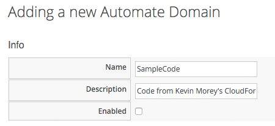
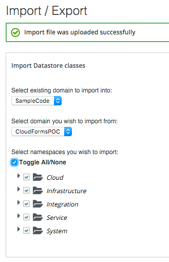
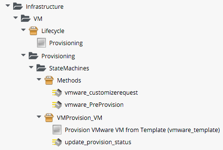
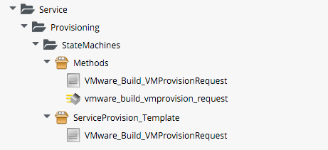
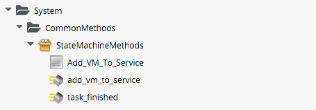
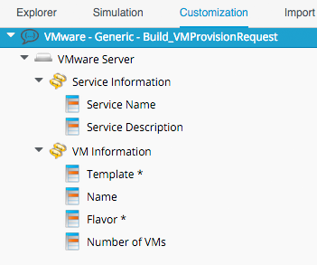
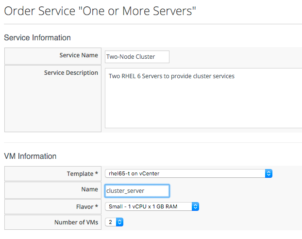
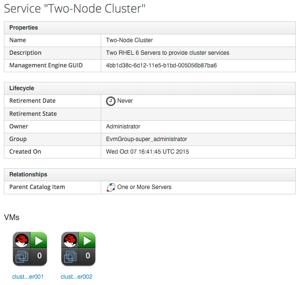

## Custom State Machines

There are times when an out-of-the-box Service Provision State Machine does not provide the flexibility that we need to create the service that we require. An example of this would be if we wish to offer our users the choice of how many VMs to provision when ordering from a Service Catalog, or to dynamically select the template to provision from.

When we create a new Service Catalog Item, we are presented with a drop-down list of Catalog Item Types to choose from:


If we pick any of the Cloud or Infrastructure Provider types, we are prompted to select a template or image to provision from, and we complete the dialog options to specify how we would like that VM provisioned. Once we save the new Catalog Item, these selections are "hard-coded" in an _MiqProvisionRequestTemplate_ object that contains the "request" options hash (containing _:number\_of\_vms_ for example), and a ```.source``` association to the template to be provisioned from. We have no way of changing these when we order the service.

Fortunately there's a _Generic_ Catalog Item Type that we can use to create a custom State Machine, and we can use this to assemble arguments for, and call, ```$evm.execute('create_provision_request')``` (see [Creating Provisoning Requests Programmatically](../chapter17/create_provision_request.md)). 

By hand-rolling the arguments to create\_provision\_request, we have complete control over the VM Provision Request. We can specify the template name or _:number\_of\_vms_ dynamically at run-time if required.

### Importing an Example

Kevin Morey has created an example of such a State Machine in his excellent [CloudFormsPOC](https://github.com/ramrexx/CloudFormsPOC/wiki) code collection. We'll import this into a new _SampleCode_ domain, and create our own Service Catalog Item from it.

#### Importing the Code

First we must create the new domain into which we can import the code. We won't enable this new domain as we'll copy any code that we want into our own domain:



After following Kevin's instructions on downloading and zipping the Automation code, we can import it from the Automate -> Import / Export menu:



Kevin has made quite a few enhancements, so we need to import some Methods and Instances from four different namespaces in the imported domain into our own domain. We'll be using a VMware provider for this example, so we'll copy the VMware-specific customisations.

From the _Infrastructure_ namespace:



<br>
From the _Integration_ namespace:


<br>
From the _Service_ namespace:



<br>
From the _System_ namespace:



#### Importing the Service Dialog

Now we'll import the _VMware - Generic - Build\_VMProvisionRequest_ Service Dialog from Kevin's code collection. Go to Automate -> Customization, and to the Import/Export section in the accordion. Using _Choose File_, select _ServiceDialogs/VMware - Generic - Build\_VMProvisionRequest.yml_ from the expanded CloudFormsPOC-master.zip. Click _Upload_.

We're going to edit Kevin's Service Dialog to simplify it for our needs. Edit the dialog, and remove all but the following elements:
<br> <br>



<br>
The _Template_ element is dynamic. Ensure that its Entry Point is our newly imported _/Integration/VMware/DynamicDropDowns/List\_VMware\_Templates_ Instance, and ensure that _Include Domain prefix in the path_ is checked.

### Creating the Service Catalog Item

We'll create the new Service Catalog Item as we did before, but we'll pick _Generic_ as the Catalog Item Type.

We enter a Name and Description, and check _Display in Catalog_ to reveal the other options. We select a suitable Catalog, and the new _VMware - Generic - Build\_VMProvisionRequest_ Dialog from the drop-downs.

Finally we select _/Service/Provisioning/StateMachines/ServiceProvision\_Template/VMware\_Build\_VMProvisionRequest_ from our Domain as the Provisioning Entry Point, and ensure that _Include Domain prefix in the path_ is checked. Save the new Catalog Item.

### Ordering the Service

When we order the Service Catalog Item, we see that the Dialog has enumerated all templates on our Provider, and presents them to us as a drop-down list. We also get the option to select the number of VMs to provision:
<br> <br>



We complete the dialog and click _Submit_, and after a while our new Service is ready:
<br> <br>



Success!


 