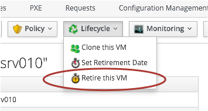
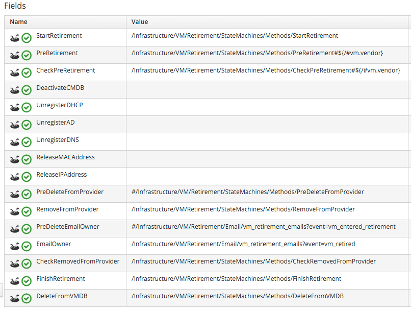
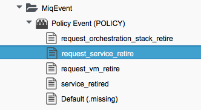
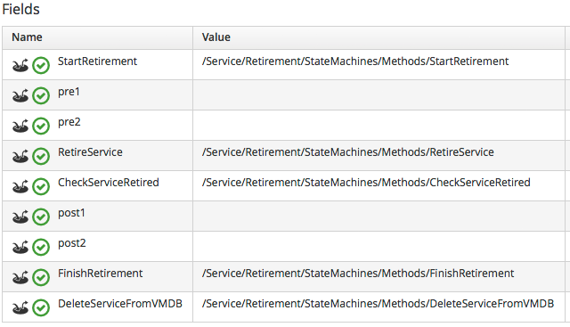

## Retirement
The Retirement process for VMs, Instances and Services was substantially re-written for ManageIQ _Botvinnik_ (CloudForms Management Engine 5.4). This section describes the workflow in ManageIQ _Capablanca_ (CloudForms Management Engine 5.5).

### VM and Instance Retirement

VM or Instance retirement is initiated from the Lifecycle menu on the VM details page:
<br> <br>



This raises a _request\_vm\_retire_ event that enters the Event Switchboard as an `MiqEvent/POLICY` event:
<br> <br>


<br> <br>
This is redirected to a `Cloud` or `Infrastructure` (as appropriate) `/VM/Lifecycle/Retirement` Instance:
<br> <br>


<br> <br>

The `Lifecycle/Retirement` Instance redirects us into the desired VM Retirement State Machine (`Default` for Cloud Instances, `Default` or `Unregister` for Infrastructure VMs):
<br> <br>


#### Retirement-Related Attributes and Methods

A VM object has a number of retirement-related methods:

```  
$evm.root['vm'].start_retirement
$evm.root['vm'].finish_retirement
$evm.root['vm'].retire_now
$evm.root['vm'].retired?
$evm.root['vm'].retirement_state=
$evm.root['vm'].retirement_warn=
$evm.root['vm'].retires_on=
$evm.root['vm'].retiring?
```
It also has several attributes:

```
$evm.root['vm'].retired = nil
$evm.root['vm'].retirement_last_warn = nil
$evm.root['vm'].retirement_requester = nil
$evm.root['vm'].retirement_state = nil
$evm.root['vm'].retirement_warn = nil
$evm.root['vm'].retires_on = nil
```
During the retirement process some of these are set to indicate progress:

```
$evm.root['vm'].retirement_requester = admin   (type: String)
$evm.root['vm'].retirement_state = retiring   (type: String)
```
and completion:
     
```     
$evm.root['vm'].retired = true   (type: TrueClass)
$evm.root['vm'].retirement_requester = nil
$evm.root['vm'].retirement_state = retired   (type: String)
$evm.root['vm'].retires_on = 2015-12-10   (type: Date)
```

#### VM Retirement State Machine

The VM Retirement State Machines(s) undo many of the operations performed by the VM Provisioning State Machine. They allow us to optionally deactivate a CI record from a CMDB, unregister from DHCP, Active Directory and DNS, and release both MAC and IP addresses.



##### StartRetirement

The `StartRetirement` Instance calls the `start_retirement` State Machine Method, which checks whether the VM is already in state 'retired' or 'retiring', and if so it aborts. If in neither of these states it calls the VM's `start_retirement` method, which sets the **retirement_state** attribute to 'retiring'.

##### PreRetirement / CheckPreRetirement

The State Machine allows us to have Provider-specific Instances and Methods for these stages, but the out-of-the-box `PreRetirement` Instance runs a vendor-independant `pre_retirement` Method that just powers off the VM. **CheckPreRetirement** checks that the power off has completed.

##### RemoveFromProvider / CheckRemovedFromProvider

The **RemoveFromProvider** stage allows us some flexibility in handling the actual removal of the VM, and this is where the `Default` and `Unregister` State Machines differ.

###### Default

The **RemoveFromProvider** stage of the `Default` State Machine links to the `RemoveFromProvider` Instance, which calls the `remove_from_provider` State Machine Method, passing the argument `removal_type => 'remove_from_disk'`. This checks whether the VM was provisioned from CloudForms/ManageIQ (`vm.miq_provision` is not **nil** ), **or** if the VM is tagged with **lifecycle/retire\_full**. If either of these is true it fully deletes the VM from the underlying provider, including the disk image. Having done so it sets a boolean state variable `vm_removed_from_provider` to **true**.

If neither of these checks returns **true**, no action is performed.

###### Unregister

The **RemoveFromProvider** stage of the `Unregister` State Machine links to the `UnregisterFromProvider` Instance, which calls the `remove_from_provider` State Machine Method, passing the argument `removal_type => 'unregister'`. This checks whether the VM was provisioned from CloudForms/ManageIQ (`vm.miq_provision` is not **nil** ), **or** if the VM is tagged with **lifecycle/retire\_full**. If either of these is true it deletes the VM from the underlying provider, but retains the VM's disk image, allowing the VM to be re-created if required in the future. Having done so it sets a boolean state variable `vm_removed_from_provider` to **true**.

If neither of these checks is true, no action is performed.

##### FinishRetirement

The `FinishRetirement` Instance calls the `finish_retirement` State Machine Method that sets the following VM object attributes:

```
:retires_on => Date.today
:retired => true
:retirement_state => "retired"
```
It also raises a _vm\_retired_ event that can be caught by an Automate action or Control Policy.

##### DeleteFromVMDB

The `DeleteFromVMDB` Instance calls the `delete_from_vmdb` State Machine Method, that checks for the state variable `vm_removed_from_provider`, and if found (and true) it removes the VM record from the VMDB.


### Service Retirement

#### Defining a Service Retirement Entry Point

When we create a Service Catalog Item, we can optionally specify a Retirement Entry Point:


If we specify our own Retirement Entry Point, then this State Machine will be used to retire any services created from this Catalog Item, rather than the Default.

#### Retiring the Service

Service retirement is initiated from the Lifecycle menu on the Service details frame:
<br> <br>


This raises a _request\_service\_retire_ event that enters the Event Switchboard as an `MiqEvent/POLICY` event:
<br> <br>


<br> <br>
which redirects to `/Service/Retirement/StateMachines/Methods/GetRetirementEntryPoint`:
<br> <br>


<br> <br>

This Instance runs a Method `get_retirement_entry_point` that returns the Retirement Entry Point defined when the Service Catalog Item was created. If this is empty then `/Service/Retirement/StateMachines/ServiceRetirement/Default` is returned.

#### Retirement-Related Attributes and Methods

A Service object has a number of retirement-related methods:

```
$evm.root['service'].automate_retirement_entrypoint
$evm.root['service'].finish_retirement
$evm.root['service'].retire_now
$evm.root['service'].retire_service_resources
$evm.root['service'].retired?
$evm.root['service'].retirement_state=
$evm.root['service'].retirement_warn=
$evm.root['service'].retires_on=
$evm.root['service'].start_retirement
```
and attributes:

```
$evm.root['service'].retired = nil
$evm.root['service'].retirement_last_warn = nil
$evm.root['service'].retirement_requester = nil
$evm.root['service'].retirement_state = nil
$evm.root['service'].retirement_warn = nil
$evm.root['service'].retires_on = nil
```

#### Default Service Retirement State Machine

The Default Service Retirement State Machine is simpler than its VM counterpart:
 



##### StartRetirement

The `StartRetirement` Instance calls the `start_retirement` State Machine Method, which checks whether the Service is already in state 'retired' or 'retiring', and if so it aborts. If in neither of these states it calls the Service's `start_retirement` method, which sets the retirement_state attribute to 'retiring'.

##### RetireService / CheckServiceRetired

The `RetireService` Instance calls the `retire_service` State Machine Method, that in turn calls the Service object's `retire_service_resources` method. This method calls the `retire_now` method of every VM comprising the Service, to initiate their retirement. **CheckServiceRetired** retries the stage until all VMs are retired or deleted.

##### FinishRetirement

The **FinishRetirement** stage sets the following Service object attributes:

```
:retires_on => Date.today
:retired => true
:retirement_state => "retired"
```
It also raises a _service\_retired_ event that can be caught by an Automate action or Control Policy.

##### DeleteServiceFromVMDB

The `DeleteServiceFromVMDB` Instance calls the `delete_service_from_vmdb` State Machine Method, which removes the Service record from the VMDB.