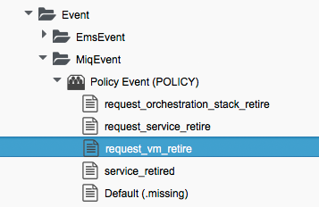
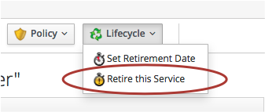

## Service Dialogs

Service dialogs are used in several situations when working with CloudForms Automation, and we saw an example of creating a simple service dialog to use with a button in [A More Advanced Example](../chapter7/a_more_advanced_example.md). This example used two text boxes to prompt for simple text string values to pass to the Automation Method, but we can use several different element types when we create dialogs...



The available element types are described in the CloudForms [Lifecycle and Automation Guide](https://access.redhat.com/documentation/en-US/Red_Hat_CloudForms/3.2/html-single/Lifecycle_and_Automation_Guide/index.html#sect-Service_Dialogs), although with CloudForms 3.2 they gain several useful new features.

### Dynamic Elements

Prior to CloudForms 3.2 only one element type was capable of dynamic (run-time) population - the _Dynamic Drop Down List_. Now with CloudForms 3.2 most dialog element types are capable of dynamic population, and so the _Dynamic Drop Down List_ has been removed as a separate element type.

Dynamic elements are populated from a Method, called either when the service dialog is initially displayed, or from an optional _Refresh_ button. The URI to the Method is specified when we add the element and select the checkbox to make it dynamic.

#### Populating the Dynamic Fields

The dynamic element has/is its own $evm.object, and we need to populate some pre-defined hash key/value pairs to define the dialog field settings, and to load the data to be displayed...


```ruby
dialog_field = $evm.object

# sort_by: value / description / none
dialog_field["sort_by"] = "value"

# sort_order: ascending / descending
dialog_field["sort_order"] = "ascending"

# data_type: string / integer
dialog_field["data_type"] = "integer"

# required: true / false
dialog_field["required"] = "true"

dialog_field["values"] = {1 => "one", 2 => "two", 10 => "ten", 50 => "fifty"}
dialog_field["default_value"] = 2
```

Another more real-world example is...

```ruby
  values_hash = {}
  values_hash['!'] = '-- select from list --'
  user_group = $evm.root['user'].ldap_group
  #
  # Everyone can provision to DEV and UAT
  #
  values_hash['dev'] = "Development"
  values_hash['uat'] = "User Acceptance Test"
  if user_group.downcase =~ /administrators/
    #
    # Administrators can also provision to PRE-PROD and PROD
    #
    values_hash['pre-prod'] = "Pre-Production"
    values_hash['prod'] = "Production"
  end

  list_values = {
     'sort_by'    => :value,
     'data_type'  => :string,
     'required'   => true,
     'values'     => values_hash
  }
  list_values.each { |key, value| $evm.object[key] = value }
```

The _values_ key can take as its value either a list (of tuples) or a hash. This contains the key/value pairs representing the choices to be displayed in the dynamic element, and the corresponding _data\_type_ value to be read and returned as the _dialog\_*_ option if that choice is selected.


### Read-Only and Protected Elements

CloudForms Management Engine 5.4 also introduced the concept of read-only elements for service dialogs, which cannot be changed once displayed. Having a text box dynamically populated, but read-only, makes it ideal for displaying messages.

CloudForms Management Engine 5.3.x added the ability to be able to mark a text box as protected, which results in any input being obfuscated - useful for inputting passwords.

<br>


### Element Validation

CloudForms Management Engine 5.4 introduced the ability to add input field validation to dialog elements. Currently the only Validator Types are _None_ or  _Regular Expression_, but regular expressions are useful for validating input for values such as IP Addresses...

<br>

