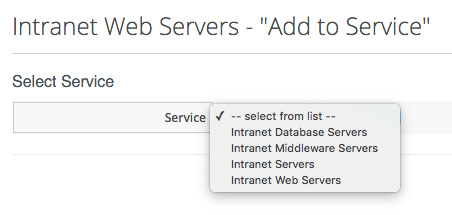

## Service Hierarchies

Services can be arranged in hierarchies for organisational and management convenience:
<br> <br>


<br> <br>
In this example we have three child Services, representing the three tiers of our simple intranet platform.

The Database Tier:


<br> <br>
The Middleware Tier:
<br> <br>

<br> <br>
The Web Tier:
<br> <br>

<br> <br>
When we view the parent Service, we see that it contains details of all child Services, including the cumulative CPU, Memory and Disk Counts:
<br> <br>


### Organising Our Services

To make maximum use of Service hierarchies, it is useful to be able to create empty Services, and to be able to move both Services and VMs into existing Services.

#### Creating An Empty Service

We could create a new Service directly from automation, using the lines:

```ruby
new_service = $evm.vmdb('service').create(:name => "My New Service")
new_service.display = true
```

For this example though, we'll create our new empty Service from a Service Catalog. 

##### State Machine

First we create a new Instance of the _/Service/Provisioning/StateMachines/ServiceProvision\_Template_ Class, but we comment out most entries:


<br> <br>
We'll call this Instance _EmptyService_.

##### Method

The _pre5_ stage of this State Machine is a Relationship to an Instance/Method containing the following code:

```ruby
begin
  service_template_provision_task = $evm.root['service_template_provision_task']
  service = service_template_provision_task.destination
  dialog_options = service_template_provision_task.dialog_options
  if dialog_options.has_key? 'dialog_service_name'
    service.name = "#{dialog_options['dialog_service_name']}"
  end
  if dialog_options.has_key? 'dialog_service_description'
    service.description = "#{dialog_options['dialog_service_description']}"
  end

  $evm.root['ae_result'] = 'ok'
  exit MIQ_OK
rescue => err
  $evm.log(:error, "[#{err}]\n#{err.backtrace.join("\n")}")
  $evm.root['ae_result'] = 'error'
  $evm.root['ae_reason'] = "Error: #{err.message}"
  exit MIQ_ERROR
end
```

##### Service Dialog

We create a simple Service Dialog with element names _service\_name_ and _service\_description_:


##### Putting It All Together

Finally we assemble all of these parts by creating a new Service Catalog called _General Services_, and a new Catalog Item of type _Generic_:


<br> <br>
We can order from this Service Catalog Item to create our new empty Services.

### Adding VMs and Services to Existing Services

Well provide the ability to move Services and VMs into existing Services, from a button:
<br> <br>

<br> <br>
The button will present a drop-down list of existing Services that we can add as a parent Service:



##### Button Dialog

We create a simple Service Dialog with dynamic drop-down element name _service_:


##### Dynamic Method

The dynamic drop-down element in the Service Dialog calls a method

```ruby
  def get_current_group_rbac_array(user, rbac_array=[])
    unless user.current_group.filters.blank?
      user.current_group.filters['managed'].flatten.each do |filter|
        next unless /(?<category>\w*)\/(?<tag>\w*)$/i =~ filter
        rbac_array << {category=>tag}
      end
    end
    $evm.log(:info, "rbac filters: #{rbac_array}")
    rbac_array
  end
  
  def service_visible?(rbac_array, service)
    rbac_array.each do |rbac_hash|
      rbac_hash.each {|category, tag| return false unless service.tagged_with?(category, tag)}
    end
    $evm.log(:info, "Service: #{service.name} is visible to this user")
    true
  end

  user = $evm.root['user']
  rbac_array = get_current_group_rbac_array(user)
  values_hash      = {}
  visible_services = []
  
  $evm.vmdb(:service).find(:all).each do |service|
    $evm.log(:info, "Found service: #{service.name}")
    if service_visible?(rbac_array, service)
      visible_services << service
    end
  end
```
The full script is available 