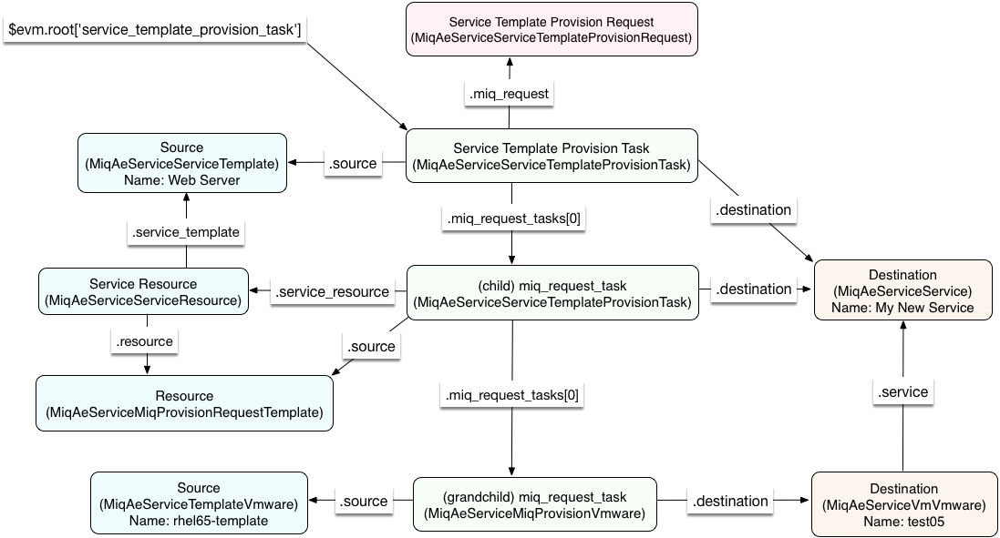

## Service Objects

We saw in [VM Provisioning Objects](../chapter17/provisioning_objects.md) that provisioning operations generally involve a _request_ object, and a _task_ object that links to _source_ and _destination_ objects.

When we provision a VM from a Service there are many more objects involved, because we are creating and referencing more items (creating both a service and potentially several new component VMs). When we provision from a service _bundle_, there will be several individual _items_ to provision as part of the bundle. Even when we provision from a single service _item_ however, the objects are structured as if we were provisioning a bundle containing only one item.

In this section we will look at some of the objects involved in provisioning a single VM from a Service Catalog Item. The objects are visible to us during the processing of the CatalogItemInitialization state machine.

For this example:

*  The provider is VMware
*  The service catalog item name that we've ordered from is called "Web Server"
*  The service catalog item was created to clone from a VMware template called "rhel65-template"
* The new service name is "My New Service"
* The resulting service contains a VM called "test05".

We can use object\_walker with the following @walk\_association\_whitelist to dump the objects...

```ruby
{ "MiqAeServiceServiceTemplateProvisionTask" => ["source", "destination", "miq_request",
												"miq_request_tasks", "service_resource"],
"MiqAeServiceServiceTemplateProvisionRequest" => ["miq_request", "miq_request_tasks",
												"requester", "resource", "source"],
"MiqAeServiceServiceTemplate" => ["service_resources"],
"MiqAeServiceServiceResource" => ["resource", "service_template"],
"MiqAeServiceMiqProvisionVmware" => ['source', 'destination', 'miq_request'],
"MiqAeServiceMiqProvisionRequestTemplate" => ['source', 'destination'],
"MiqAeServiceVmVmware" => ['service'] }
```

We'll call the ObjectWalker instance from the _post5_ state/stage of the CatalogItemInitialization state machine.

### Object Structure

We can illustrate the main object structure as follows (some objects and links/relationships have been omitted for clarity).
<br><br>




#### Service Template Provision Task

Our entry point into the object structure from $evm is to the main _ServiceTemplateProvisionTask_ object. We access this from ```$evm.root['service_template_provision_task']```, and from here we can access any of the other objects by following associations.

##### Source

Accessed from ```$evm.root['service_template_provision_task'].source```, this is the _ServiceTemplate_ object representing the service catalog item that has been ordered from.

##### Destination

Accessed from ```$evm.root['service_template_provision_task'].destination```, this is the _Service_ object representing the new service that will be created under _My Services_.


#### Service Template Provisioning Request

Accessed from ```$evm.root['service_template_provision_task'].miq_request```, this is the initial _ServiceTemplateProvisionRequest_ object that was created when we first ordered the new service. It is the request object for the entire service provision operation, including all VMs created as part of the service. This request object has associations to each of the task objects involved in assembling the service, and they in turn have back-links to this request object.

#### Child miq\_request\_task

Accessed from ```$evm.root['service_template_provision_task'].miq_request_tasks.each do |child_task|```, this is also a _ServiceTemplateProvisionTask_ object, and is the task object that represents the creation of an item for the new service.

There will be a child miq\_request\_task for each item (e.g. VM) that makes up the final service, so for a service bundle containing three VMs, there will be three child miq\_request\_tasks. 

##### Service Resource

Accessed from ```child_task.service_resource```, this _ServiceResource_ object stores details about this particuar service item, and its place in the overall service structure. 

The _ServiceResource_ object has attributes such as...

```
service_resource.group_idx
service_resource.provision_index
...
service_resource.start_action
service_resource.start_delay
service_resource.stop_action
service_resource.stop_delay
```

These are generally zero or _nil_ for a single-item service, but represent the values selected in the UI for a multi-item service bundle, i.e.


The Service Resource has a relationship to the _ServiceTemplate_ object via ```child_task.service_resource.service_template```.

##### Source

Accessed from ```child_task.source``` or ```child_task.service_resource.resource```, this is the _MiqProvisionRequestTemplate_ object that describes how the resulting VM will be created. The object looks very similar to a traditional VM provisioning request object, and contains an options hash populated from the dialog options that were selected when the service item was created (e.g. placement options, memory size, CPUs, etc).

##### Destination

Accessed from ```child_task.destination```, this is the same _Service_ object that is accessible from ```$evm.root['service_template_provision_task'].destination```.

#### Grandchild miq\_request\_task

Accessed from ```child_task.miq_request_tasks.each do |grandchild_task|```, this is an _MiqProvisionVmware_ miq\_request\_task object, and is the task object that represents the creation of the VM. This is exactly the same as the Task Object described in [VM Provisioning Objects](../chapter17/provisioning_objects.md).

It is the grandchild miq\_request\_task that contains the options hash for the VM to be provisioned; this being cloned from the options hash in the _MiqProvisionRequestTemplate_ object. If we have a service dialog that prompts for properties affecting the provisioned VM (such as VM name, number of CPUs, memory, etc.), we must pass these dialog values to the grandchild task options hash.

##### Source

Accessed from ```grandchild_task.source```, this is the _TemplateVmware_ object that represents the VMware template that the new VM will be cloned from.

##### Destination

Accessed from ```grandchild_task.destination``` or ```grandchild_task.vm```, this is the _VmVmware_ object that represents the newly created VM. This VM object has an association ```.service``` that links to the newly created service object.
