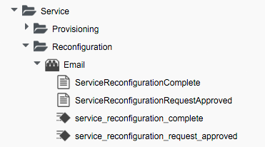
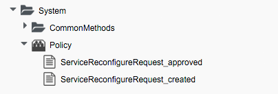
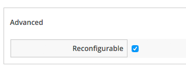
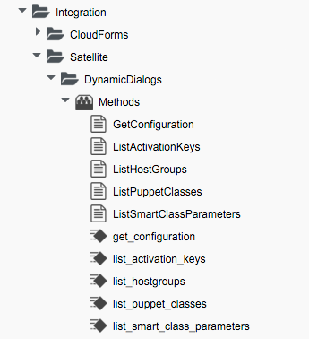
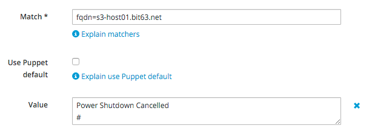

## Service Reconfiguration

So far when we have created our Service Catalog Items, we have specified a Provisioning Entry Point State Machine to handle the provisioning workflow for the new Service. There are two other Entry Points that we can optionally hook into, a Retirement Entry Point (see [Retirement](../chapter19/retirement.md)), and a Reconfigure Entry Point.
<br> <br>


If we create a Service Catalog Item to have a Reconfigure Entry Point State Machine, then any Service created from that Catalog Item will have a _Reconfigure this Service_ option available under its _Configuration_ menu:
<br> <br>


If we select this option, we are presented with the original Service Dialog once more. Entering new values and clicking the _Submit_ button will create a _ServiceReconfigureRequest_ to peform the reconfiguration action, based on the revised values that we have have entered into the dialog.

This duel-use of an initial configuration dialog as a reconfiguration dialog, works well if we are using a configuration management tool such as Foreman (or Satellite 6), and Puppet. In this case we can specify Puppet  _Smart Class Parameters_ in our Service Dialog that can be passed to Foreman and used to override the statically defined Puppet class parameters.

### Service Design

When we create a Service that can be reconfigured in this way, we need to put extra thought into our service design and provisioning workflow. We need to make some of our Service Dialog Elements _Reconfigurable_ so that we can enter new values when re-presented with the Dialog on a Service reconfiguration request (elements not marked as Reconfigurable will be greyed-out). We need to create a _set\_configuration_ method that can be called from either a VM Provisioning or Service Reconfiguration State Machine, and retrieve dialog values from the correct location in each case. This method should detect whether or not the VM Provision was initiated from a Service that passed the correct dialog values, rather than an interactive VM Provision Request for example.

### Creating the Framework

Even though a Service Reconfiguration capability is provided for us by CloudForms/ManageIQ, we still need to add several datastore components if we wish to use it.

#### Creating the Namespaces and State Machines

In our own Domain, we'll create a _/Service/Reconfiguration/StateMachines_ Namespace:
<br> <br>


We'll create a simple State Machine Class called _ServiceReconfigure_, with 7 state/stages:
<br> <br>


pre{1-3} and post{1-3} are future-proofing placeholders in case we wish to enhance the functionality in future. For now we'll just be using the _reconfigure_ state/stage.

We'll clone _/Service/Provisioning/StateMachines/ServiceProvision\_Template/update\_serviceprovision\_status_ from the _ManageIQ_ Domain into ours, and rename it to _update\_servicereconfigure\_status_. We change line 6 from:

```prov = $evm.root['service_template_provision_task']```

to:

```reconfigure_task = $evm.root['service_reconfigure_task']```

<br>
We'll edit the _On Entry_, _On Exit_ and _On Error_ columns in the State Machine Class Schema to refer to the new _update\_servicereconfigure\_status_ Method:
<br> <br>


We create a _Default_ Instance of the _ServiceReconfiguration_ State Machine Class, and we'll point the _reconfigure_ stage to the _SetConfiguration_ Instance that we'll create:
<br> <br>


#### Email Classes

We need to create two new email Instances with associated Methods, to send emails when a Service Reconfigure is Approved and Completed. For convenience we'll just copy, rename and edit the _ManageIQ/Service/Provisioning/Email_ Instances and Methods:
<br> <br>



#### Policies

We need to generate Policy Instances for two ServiceReconfigure events, _ServiceReconfigureRequest\_created_ and _ServiceReconfigureRequest\_approved_.

We copy _/ManageIQ/System/Policy/ServiceTemplateProvisionRequest\_created_ into our Domain as _System/Policy/ServiceReconfigureRequest\_created_. We can leave the schema contents as they are because we'll use the same auto-approval state machine as when the service was originally provisioned.

We copy _/ManageIQ/System/Policy/ServiceTemplateProvisionRequest\_approved_ into our Domain as _System/Policy/ServiceReconfigureRequest\_approved_, and we edit the _rel5_ state to point to our new _/Service/Reconfiguration/Email/ServiceReconfigurationRequestApproved_ email Instance:
<br> <br>



### Modifying the VM Provision Workflow

We need to change our VM Provision workflow to add a state/stage to perform the initial configuration using the values input from the Service Dialog. We'll take the State Machine that we used in [Integrating with Satellite 6 During Provisioning](../chapter17a/integrating_with_satellite_6.md) and add a _SetConfiguration_ stage after _RegisterSatellite_. _SetConfiguration_ points to the same Instance as our new _ServiceReconfiguration_ State Machine's _reconfigure_ stage:
<br> <br>
 


### Service Dialog

We're going to create a completely dynamic service dialog, interacting with Satellite to retrieve information. The dialog will query Satellite for all Host Groups, and present them in a drop-down list. For the Host Group selected, Satellite will be queried for the configured Activation Keys and Puppet Classes, and these will be presented in drop-down lists. For the Puppet Class selected, Satellite will be queried for the available Smart Class Parameters and these will be presented in a drop-down list. Finnaly a text area box will be presented to optionally input an override parameter.

The _Puppet Class_, _Smart Class Parameter_ and _New Parameter Value_ elements will be marked as _Reconfigurable_ in the Service Dialog:



When ordered the Dialog will look as follows:
<br> <br>
 


### Methods

#### Dynamic Dialogs

The dynamic dialog Instances and Methods are defined under an _/Integration/Satellite/DynamicDialogs_ Namespace in our Domain:
<br> <br>



The Schema for the _Methods_ class holds variables containing the credentials to connect to our Satellite server.

##### Common Functionality

Each of the dynamic Methods has a simple _rest\_action_ method to perform the REST call to Satellite

```ruby
def rest_action(uri, verb, payload=nil)
  headers = {
    :content_type  => 'application/json',
    :accept        => 'application/json;version=2',
    :authorization => "Basic #{Base64.strict_encode64("#{@username}:#{@password}")}"
  }
  response = RestClient::Request.new(
    :method      => verb,
    :url         => uri,
    :headers     => headers,
    :payload     => payload,
    verify_ssl: false
  ).execute
  return JSON.parse(response.to_str)
end
```

They each pull the credentials from the Instance schema, define the base URI and an empty values_hash

```ruby
servername = $evm.object['servername']
@username  = $evm.object['username']
@password  = $evm.object.decrypt('password')

uri_base = "https://#{servername}/api/v2"
values_hash = {}
```

##### list_hostgroups

The Method **list\_hostgroups** makes a simple call to /hostgroups:

```ruby
rest_return = rest_action("#{uri_base}/hostgroups", :get)
  
if rest_return['total'] > 0
  if rest_return['total'] > 1
    values_hash['!'] = '-- select from list --'
  end
  rest_return['results'].each do |hostgroup|
    values_hash[hostgroup['id'].to_s] = hostgroup['name']
  end
else
  values_hash['!'] = 'No hostgroups are available'
end
```
##### list_activationkeys

The Method **list\_activationkeys** retrieves the hostgroup\_id from the _Host Group_ element, and makes a call to get the hostgroup parameters

```ruby
  hostgroup_id = $evm.object['dialog_hostgroup_id']

  if hostgroup_id.nil?
    values_hash['!'] = "Select a Host Group and click 'Refresh'"
  else
    rest_return = rest_action("#{uri_base}/hostgroups/#{hostgroup_id}/parameters", :get)
    rest_return['results'].each do |hostgroup_parameter|
      if hostgroup_parameter['name'].to_s == "kt_activation_keys"
        hostgroup_parameter['value'].split(',').each do |activationkey|
          values_hash[activationkey] = activationkey
        end
      end
    end
    if values_hash.length > 0
      if values_hash.length > 1
        values_hash['!'] = '-- select from list --'
      end
    else
      values_hash['!'] = 'This Host Group has no Activation Keys'
    end
  end
```

##### list_puppetclasses

The Method **list\_puppetclasses** retrieves the hostgroup\_id from the _Host Group_ element, and makes a call to get the puppet classes associated with the host group

```ruby
hostgroup_id = $evm.object['dialog_hostgroup_id']

if hostgroup_id.nil?
  values_hash['!'] = "Select a Host Group and click 'Refresh'"
else
  rest_return = rest_action("#{uri_base}/hostgroups/#{hostgroup_id}/puppetclasses", :get)
  if rest_return['total'] > 0
    if rest_return['total'] > 1
      values_hash['!'] = '-- select from list --'
    end
    rest_return['results'].each do |classname, classinfo|
      values_hash[classinfo[0]['id'].to_s] = classname
    end
  else
    values_hash['!'] = 'No Puppet Classes are defined for this Hostgroup'
  end
end
```

##### list_smart_class_parameters

The Method **list\_smart\_class\_parameters** retrieves the hostgroup\_id and puppetclass_id from previous elements, and makes a call to get the puppet smart class parameters associated with the host group. For each parameter returned it then makes a further call to cross-reference against the requested puppet class (this operation will be slow if many puppet classes with smart class variables are defined in our host group, but is suitable for our example).

```ruby
hostgroup_id    = $evm.object['dialog_hostgroup_id']
puppet_class_id = $evm.object['dialog_puppet_class_id']

if puppet_class_id.nil?
  values_hash['!'] = "Select a Puppet Class and click 'Refresh'"
else
  call_string = "#{uri_base}/hostgroups/#{hostgroup_id}/smart_class_parameters"
  rest_return = rest_action(call_string, :get)
  rest_return['results'].each do |parameter|
    #
    # Retrieve the details of this smart class parameter 
    # to find out which puppet class it's associated with
    #
    call_string = "#{uri_base}/hostgroups/#{hostgroup_id}/smart_class_parameters/#{parameter['id']}"
    parameter_details = rest_action(call_string, :get)
    if parameter_details['puppetclass']['id'].to_s == puppet_class_id
      values_hash[parameter['id'].to_s] = parameter_details['parameter']
    end
  end
  if values_hash.length > 0
    if values_hash.length > 1
      values_hash['!'] = '-- select from list --'
    end
  else
    values_hash['!'] = 'This Puppet class has no Smart Class Parameters'
  end
end
```


#### Configuration

The _SetConfiguration_ Instance will be called from two completely different State Machines, once to perform an initial configuration during provisioning, and possibly again during a service reconfigure request. The _set\_configuration_ Method must retrieve the Service Dialog values from either of two different places:


```ruby
  if $evm.root['vmdb_object_type'] == 'miq_provision'
    parameter_id    = $evm.root['miq_provision'].get_option(:dialog_parameter_id)
    parameter_value = $evm.root['miq_provision'].get_option(:dialog_parameter_value)
    hostgroup_id    = $evm.root['miq_provision'].get_option(:dialog_hostgroup_id)
    hostname        = $evm.root['miq_provision'].get_option(:dialog_vm_name)
  elsif $evm.root['vmdb_object_type'] == 'service_reconfigure_task'
    parameter_id    = $evm.root['dialog_parameter_id']
    parameter_value = $evm.root['dialog_parameter_value']
    hostgroup_id    = $evm.root['dialog_hostgroup_id']
    hostname        = $evm.root['dialog_vm_name']  
  end
```
### Testing

We'll order a new service, we'll select the _motd_ class, and override the _content_ Smart Class Parameter:
<br> <br>
 


Logging in to the newly provisioned server confirms that the motd has been set:

```
root@192.168.2.193's password:
Last login: Sat Nov  7 09:48:50 2015 from cloudforms05.bit63.net
Power Shutdown Saturday 7th Nov 12pm
#[root@s3-host01 ~]#
```
If we look at the details of our new Service in _My Services_ and select Configuration -> Reconfigure This Service, we are again presented with the service dialog, but the elements not marked as _Reconfigurable_ are greyed out:
<br> <br>


We can select the _motd_ Puppet Class again, enter a new value for the _content_ Smart Class Parameter, and click _Submit_.

We receive an email informing us that the reconfiguration request has been approved:

```
Hello, 
Your Service reconfiguration request was approved. If Service reconfiguration 
is successful you will be notified via email when the Service is available.

Approvers notes: Auto-Approved

To view this Request go to: https://192.168.1.245/miq_request/show/1000000000109

Thank you,
Virtualization Infrastructure Team
```

We can login to the Satellite 6 User Interface to confirm that the "Override value for specific hosts" contains our updated value:
<br> <br>



Once the Puppet agent has run on the client again, we can login and see the new message:

```
root@192.168.2.193's password:
Last login: Sat Nov  7 10:02:29 2015 from my-macbook-pro.bit63.net
Power Shutdown Cancelled
#[root@s3-host01 ~]#
```

Success!

