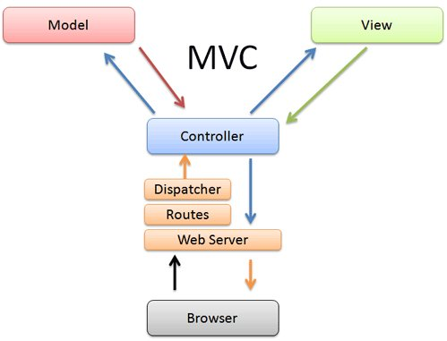

## A Little Rails Knowledge (goes a long way)
CloudForms / ManageIQ is a Ruby on Rails application, and so the Automation Engine that we work in is created using Rails, but it cleverly hides most of the "Rails-ness" of the larger application from us. It is still however useful to have a slight understanding of some of the features and concepts of Rails.

### Model-View-Controller
Rails is a Model-View-Controller (MVC) application (see also [Ruby on Rails/Getting Started/Model-View-Controller](http://en.wikibooks.org/wiki/Ruby_on_Rails/Getting_Started/Model-View-Controller))



The _Model_ represents the information and the data from the database (which in the case of CloudForms/ManageIQ is PostgreSQL), and it's the models that most interest us as Automation scripters. 

Rails Models are called _Active Records_. They always have a singular _CamelCase_ name (e.g. GuestApplication), and their corresponding database tables have a plural _snake\_case_ name (e.g. guest_applications).

### Rails console
We can connect to the Rails console to have a look around. On the CloudForms appliance itself:

```
vmdb  # alias vmdb='cd /var/www/miq/vmdb/' is defined on the appliance
source /etc/default/evm
bin/rails c
Loading production environment (Rails 3.2.17)
irb(main):001:0>
```

### Rails db
Similarly we can connect to the Rails db, which puts us into a psql session.

```
vmdb
source /etc/default/evm
bin/rails db
```


### Active Record Associations

Active Record Associations link the Models together in a way that makes it easy for us to 

We can illustrate this by looking at some of the code that defines the _Host_ Active Record:

```ruby
class Host < ActiveRecord::Base
  ...
  belongs_to                :ext_management_system, :foreign_key => "ems_id"
  belongs_to                :ems_cluster
  has_one                   :operating_system, :dependent => :destroy
  has_one                   :hardware, :dependent => :destroy
  has_many                  :vms_and_templates, :dependent => :nullify
  has_many                  :vms
  ...
```

### Rails Helper Methods (.find\_by\_*)
Rails does a lot of things to make our lives easier, including dynamically creating _helper methods_.