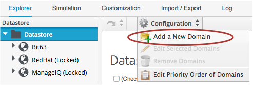
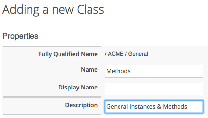
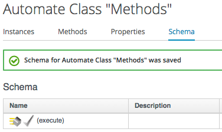

##Creating the Class

Before we create our first Automation script, we need to put some things in place. We'll begin by creating a new domain called _ACME_.

In the Automation Explorer, highlight the _Datastore_ icon in the side bar, and click _Configuration -> Add a New Domain_
   

 
We'll give the domain the name _ACME_, and ensure the _Enabled_ checkbox is ticked...
   

 
Now we'll add a namespace into this domain, called _General_. Highlight the _ACME_ domain icon in the side bar, and click _Configuration -> Add a New Namespace_
   

 
Give the namespace the name _General_...
   

 
Now we'll create a new class, called _Methods_. (it may seem that naming a class _Methods_ is somewhat confusing, however many of the generic classes in the _ManageIQ_ and _RedHat_ domains in the automation datastore are called _Methods_ to signify their general-purpose nature).

Highlight the _General_ domain icon in the side bar, and click _Configuration -> Add a New Class_
   

 
Give the class the name _Methods_...
   

 
We'll leave the _Display Name_ blank for this example.

We'll create a simple schema. Click the _schema_ tab for the _Methods_ class, and click _Configuration -> Edit selected Schema_
   

 
Click _New Field_, and add a single field with name _execute_, Type _Method_ and Data Type _String_.
   

 
Click the tick in the left hand column to save the field entry, and click the _Save_ button to save the schema.
   

 
We now have our generic class defininition called _Methods_ setup, with a simple schema that executes a single method.

