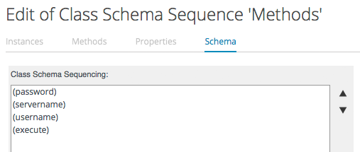
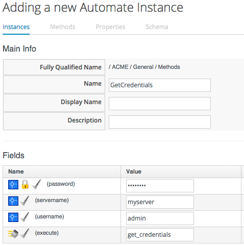

## Using Schema/Object Variables

Our next Automation example will reference variables that we can define and set in the Schema of our Class and Instance.

We'll edit the Schema of the `Methods` Class:
<br> <br>


<br>
We'll add three attributes, _servername_, _username_ and _password_, as shown:
<br> <br>


<br>
Click **Save**:
<br> <br>


<br>
We need to ensure that the Schema method (our _execute_ field) is listed _after_ the three new schema attributes in the field list, otherwise they won't be visible to the method when it runs. If necessary, run **Configuration -> Edit sequence** to shuffle the schema fields up or down:
<br> <br>



<br>
Now we'll create a new Instance as before, this time called _GetCredentials_, and we'll fill in some values for the _servername_, _username_ and _password_ Schema attributes:
<br> <br>



<br>
We'll create a Method _get\_credentials_ containing the following code:

```ruby
$evm.log(:info, "get_credentials started")

servername = $evm.object['servername']
username   = $evm.object['username']
password   = $evm.object.decrypt('password')

$evm.log(:info, "Server: #{servername}, Username: #{username}, Password: #{password}")
exit MIQ_OK
```
<br>


<br>
Finally we'll run the new Instance through **Automate -> Simulation** again, invoking `Call_Instance` once more with the following attributes:
<br> <br>


<br>
We check `automation.log`, and see that the attributes have been retrieved from the instance schema, and the password has been decrypted.

```
...Invoking [inline] method [/ACME/General/Methods/get_credentials] with inputs [{}]
...<AEMethod [/ACME/General/Methods/get_credentials]> Starting
...<AEMethod get_credentials> get_credentials started
...<AEMethod get_credentials> Server: myserver, Username: admin, Password: p@ssword
...<AEMethod [/ACME/General/Methods/get_credentials]> Ending
...Method exited with rc=MIQ_OK
```

We can use this technique to securely store and retrieve credentials to connect to anything else in our Enterprise.
