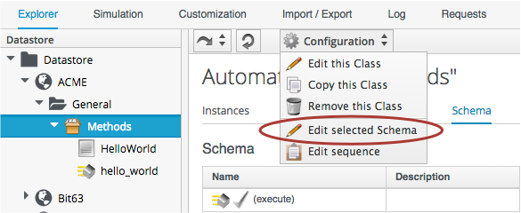
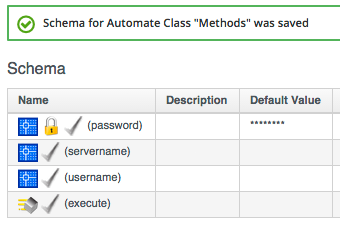
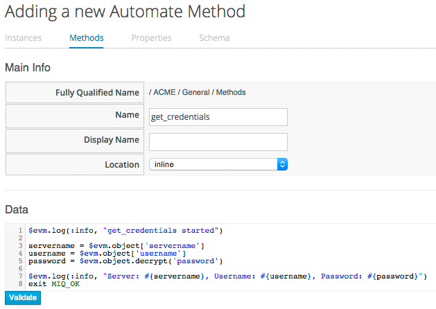

## Using Schema/Object Variables

Our next Automation example will reference variables that we can define and set in the schema of our class and instance.

We'll edit the schema of the _Methods_ class... 


...and add three attributes, _servername_, _username_ and _password_, as shown:



Click _Save_


We need to ensure that the schema method (our _execute_ field) is listed _after_ the three new schema attributes in the field list, otherwise they won't be visible to the method when it runs. If necessary, run _Configuration -> Edit sequence_ to shuffle the schema fields up or down:



Now we'll create a new instance as before, this time called _GetCredentials_, and we'll fill in some values for the _servername_, _username_ and _password_ schema attributes.


We'll create a method _get\_credentials_ conatining the following code:

```ruby
$evm.log(:info, "get_credentials started")

servername = $evm.object['servername']
username = $evm.object['username']
password = $evm.object.decrypt('password')

$evm.log(:info, "Connecting to #{servername} using Username: #{username} and Password: #{password}")
exit MIQ_OK
```


Finally we'll run the new instance through Automate -> Simulation again, invoking Call_Instance once again with the following attributes:



We check automation.log, and see that the attributes have been retrieved from the instance schema, and the password has been decrypted. We can use this technique to securely store and retrieve credentials to connect to anything else in our Enterprise.

```
[----] I, [2015-06-02T10:56:18.577190 #2690:ee3004]  INFO -- : Following Relationship [miqaedb:/Tutorial/General/Methods/GetCredentials#create]
[----] I, [2015-06-02T10:56:18.599588 #2690:ee3004]  INFO -- : Updated namespace [General/Methods/get_credentials  Tutorial/General]
[----] I, [2015-06-02T10:56:18.603303 #2690:ee3004]  INFO -- : Invoking [inline] method [Tutorial/General/Methods/get_credentials] with inputs [{}]
[----] I, [2015-06-02T10:56:18.603738 #2690:ee3004]  INFO -- : <AEMethod [Tutorial/General/Methods/get_credentials]> Starting
[----] I, [2015-06-02T10:56:18.914428 #2690:6515fd0]  INFO -- : <AEMethod get_credentials> get_credentials started
[----] I, [2015-06-02T10:56:18.916492 #2690:6515fd0]  INFO -- : <AEMethod get_credentials> Connecting to server1.bit63.com using Username: admin and Password: p@ssword
[----] I, [2015-06-02T10:56:18.925462 #2690:ee3004]  INFO -- : <AEMethod [Tutorial/General/Methods/get_credentials]> Ending
[----] I, [2015-06-02T10:56:18.925540 #2690:ee3004]  INFO -- : Method exited with rc=MIQ_OK
[----] I, [2015-06-02T10:56:19.030219 #2690:ee3004]  INFO -- : Followed  Relationship [miqaedb:/Tutorial/General/Methods/GetCredentials#create]
```