## A More Advanced Example

In this example we'll create an automate method that adds a custom attribute to a VM. We'll launch the automation instance from a button, and we'll include a dialog to prompt for the text to add.

### Creating the Service Dialog
The first thing we must do is create a _Service Dialog_ to be displayed when our custom button is clicked.

Navigate to _Automate -> Customization_, select _Service Dialogs_ in the accordion, highlight _All Dialogs_, then select _Configuration -> Add a new Dialog_ (don't click the _Add_ button yet...)
<br> <br>

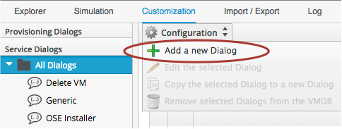

<br> <br>
Give the button a Label and Description of _Button_, check the Submit and Cancel options, and click _+ -> Add a new Tab to this Dialog_ (don't click the _Add_ button yet...)
<br> <br>

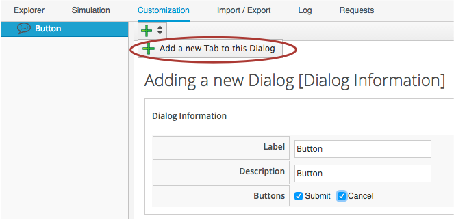

<br>
Give the tab a Label and Description of _Main_, and click _+ -> Add a new Box to this Tab_ (don't click the _Add_ button yet...)
<br> <br>


<br> <br>
Give the box a Label and Description of _Custom Attribute_, check the Submit and Cancel options, and click _+ -> Add a new Element to this Box_ (don't click the _Add_ button yet...)
<br> <br>

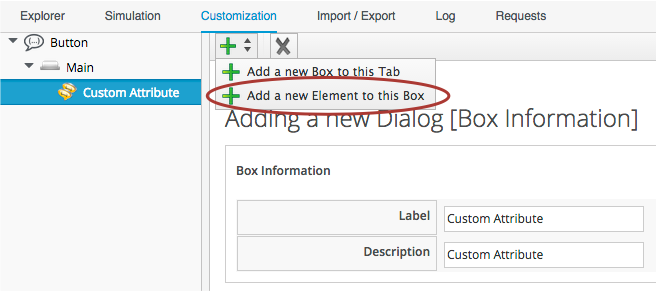

<br>
Give the new Element the Label of _Key_, the Name of _key_, and a Type of _Text Box_. Leave the other values as default (don't click the _Add_ button yet...)
<br> <br>

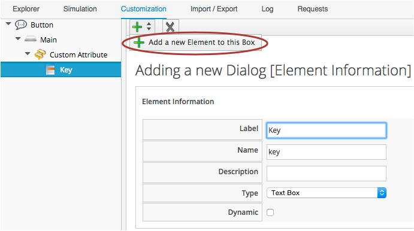

<br>
Click _+ -> Add a new Element to this Box_ to create a second element with the Label of _Value_, the Name of _value_, and a Type of _Text Box_. Leave the other values as default, and now, finally click the _Add_ button.
<br> <br>

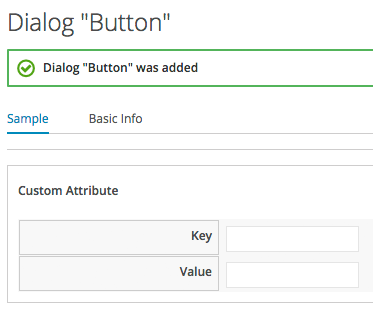

### Creating the Instance and Method

Create a new Instance in our _Methods_ class just as we did before, called _AddCustomAttribute_. Leave the _password_, _servername_ and _username_ schema fields blank, but add the value _add\_custom\_attribute_ in the _execute_ field.

Create a new Method in our _Methods_ class as we did before, called _add\_custom\_attribute_. Paste the following into the _Data_ box:

```ruby
$evm.log(:info, "add_custom_attribute started")
#
# Get the VM object
#
vm = $evm.root['vm']
#
# Get the dialog values
#
key = $evm.root['dialog_key']
value = $evm.root['dialog_value']
#
# Set the custom attribute
#
vm.custom_set(key, value)
exit MIQ_OK
```

<br>
Values entered into a dialog box are available to our method through $evm.root. The Automation Engine prefixes the dialog element names with "dialog\_", and so the values that we want to read are $evm.root['dialog\_key'] and $evm.root['dialog\_value'].

#### Create the /System Entry Point
We're going to be calling our new Instance directly from the /System/ Namespace this time rather than redirecting through Call_Instance as before, so first we must copy/clone the /ManageIQ/System/Request Class into our own domain
<br> <br>

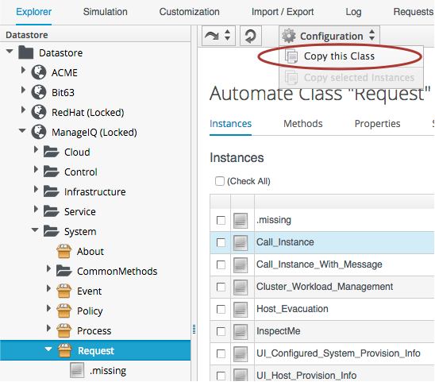

<br>
Copy the class into the ACME Domain, to the same path...
<br> <br>
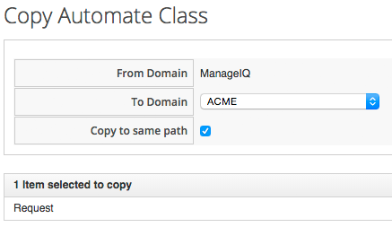

<br>
Next we have to create a new Instance of the Class...
<br> <br>

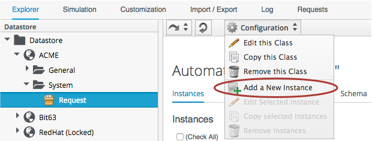

<br>
...and we enter _/General/Methods/AddCustomAttribute_ into the _rel1_ field...
<br> <br>

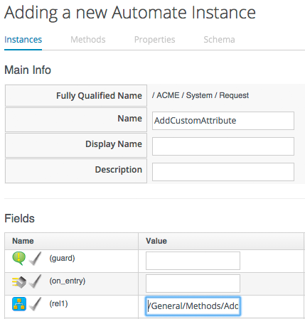

### Creating the Button
Navigate to _Automate -> Customization_, select _Buttons_ in the accordion, highlight _Object Types -> VM and Instance_, then select _Configuration -> Add a new Button Group_
<br> <br>

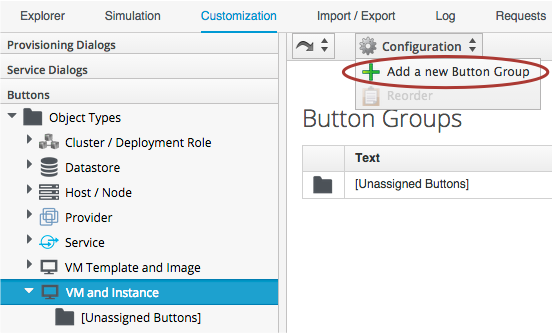

<br>
Create a Button Group called _VM Actions_, select a Button Group Image
<br> <br>

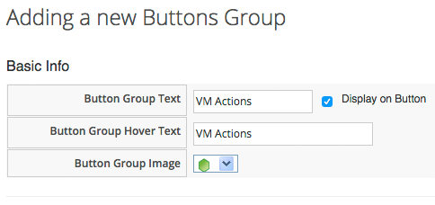

<br>
Click the _Add_ button. Now highlight this new _VM Actions_ button group in the accordion, and select _Configuration -> Add a new Button_
<br> <br>

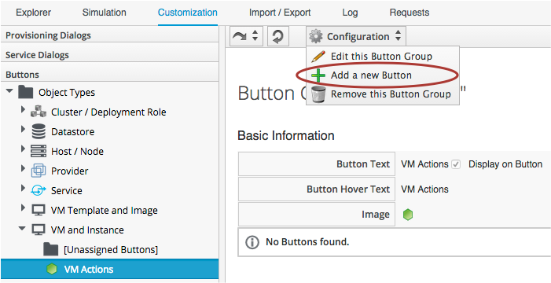

<br>
Specify a Button and Hover Text of _Add Custom Attribute_, select a suitable button image, and pick our new _Button_ Dialog from the drop-down list.
<br> <br>


### Running the Instance
If we navigate to a VM and drill down into the details, we should see our new button group and button:
<br> <br>


<br>
If we click on the _Add Custom Attribute_ button we should be presented with our dialog...
<br> <br>

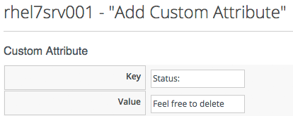

<br>
Enter some text and click _Submit_, wait a few seconds, and we should see the new custom attribute displayed at the botton of the VM details pane...
<br> <br>

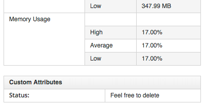
